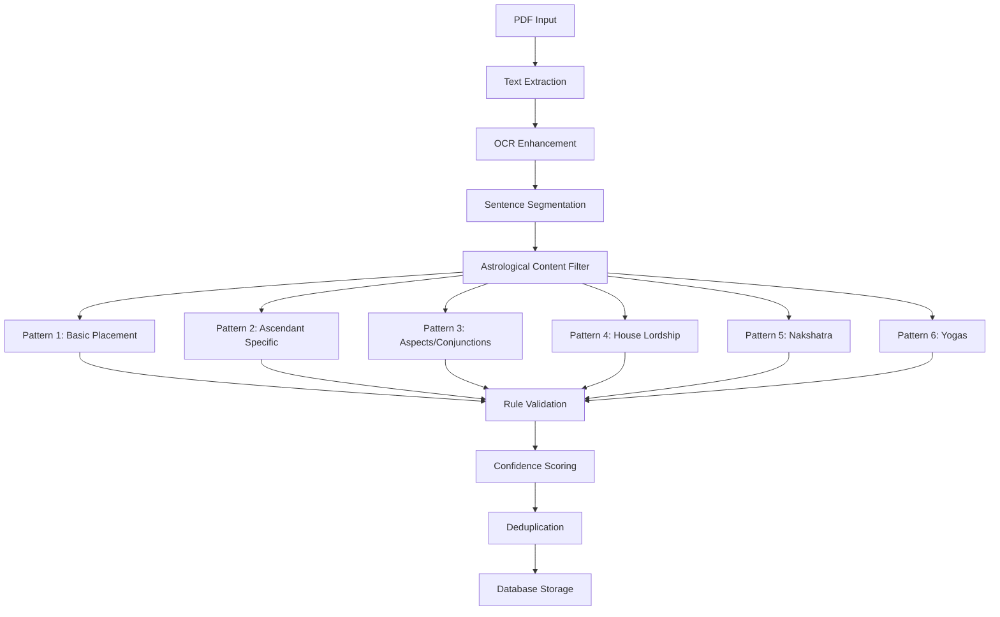

### Phase 2 Success Metrics (Personal Focus)

#### Accuracy Metrics (Primary Focus):
- [ ] **Chart Calculation Accuracy**: ±1 degree precision for all planetary positions
- [ ] **Rule Application Accuracy**: 90%+ of applicable rules correctly identified
- [ ] **Interpretation Consistency**: Same chart analyzed multiple times produces consistent results
- [ ] **Source Attribution**: 100% of interpretations traceable to specific classical sources

#### Learning Metrics:
- [ ] **Understanding Progression**: Clear explanations of how interpretations are derived
- [ ] **Concept Coverage**: Exposure to wide range of classical astrological principles
- [ ] **Validation Capability**: System helps validate your astrological understanding
- [ ] **Reference Quality**: Serves as reliable reference for classical interpretations

#### Personal Use Metrics:
- [ ] **Trust Level**: You can confidently rely on interpretations for personal insights
- [ ] **Learning Acceleration**: System accelerates your understanding of Vedic astrology
- [ ] **Self-Analysis Quality**: Provides meaningful insights for personal charts
- [ ] **Classical Authenticity**: Interpretations feel grounded in authentic tradition

### Personal-Focused Technical Dependencies

#### Core Libraries for Personal Use
```python
# requirements_personal.txt - Focused on accuracy over performance
swisseph==2.8.0           # Most accurate astronomical calculations
pyepheus==0.3.0           # Backup calculation library
astropy==5.1              # Scientific astronomical computations
pytz==2023.3              # Accurate timezone handling
timezonefinder==6.2.0     # Location-based timezone detection

# Data validation for personal accuracy
pydantic==1.10.12         # Strict data validation
marshmallow==3.19.0       # Additional validation layer

# Personal learning tools
rich==12.6.0              # Beautiful CLI output for learning
tabulate==0.9.0           # Formatted tables for rule analysis
colorama==0.4.6           # Colored output for better readability
```

#### Personal Database Schema (Accuracy-Focused)
```sql
-- Personal chart storage with full validation
CREATE TABLE personal_charts (
    id TEXT PRIMARY KEY,
    name TEXT NOT NULL,           -- "My Chart", "Partner's Chart", etc.
    birth_datetime TIMESTAMP NOT NULL,
    latitude REAL NOT NULL,
    longitude REAL NOT NULL,
    timezone TEXT NOT NULL,
    chart_data TEXT NOT NULL,     -- Full chart JSON
    calculation_method TEXT,      -- Swiss Ephemeris details
    accuracy_validated BOOLEAN DEFAULT FALSE,
    personal_notes TEXT,          -- Your observations
    created_at TIMESTAMP DEFAULT CURRENT_TIMESTAMP
);

-- Personal learning tracking
CREATE TABLE learning_sessions (
    id INTEGER PRIMARY KEY AUTOINCREMENT,
    chart_id TEXT REFERENCES personal_charts(id),
    concepts_studied TEXT,        -- JSON array of concepts
    rules_encountered TEXT,       -- JSON array of rule IDs
    insights_gained TEXT,         -- Your personal insights
    questions_raised TEXT,        -- Questions for further study
    session_date TIMESTAMP DEFAULT CURRENT_TIMESTAMP
);

-- Personal interpretation history
CREATE TABLE interpretation_history (
    id INTEGER PRIMARY KEY AUTOINCREMENT,
    chart_id TEXT REFERENCES personal_charts(id),
    interpretation_data TEXT,     -- Full interpretation JSON
    accuracy_rating INTEGER,      -- Your rating of accuracy (1-5)
    personal_feedback TEXT,       -- Your feedback on interpretation
    learning_value INTEGER,       -- How much you learned (1-5)
    created_at TIMESTAMP DEFAULT CURRENT_TIMESTAMP
);
```

---

## 🧑‍💻 Personal Development Guidelines

### Personal Learning Philosophy

#### Code as Learning Tool
```python
# Every component should teach you something about astrology
class LearningOrientedRuleExtractor:
    """Rule extractor that explains its reasoning"""
    
    def extract_with_explanation(self, text: str) -> Tuple[List[AstrologicalRule], ExtractionReport]:
        """Extract rules and explain the process"""
        
        extraction_steps = []
        
        # Step 1: Text preprocessing
        cleaned_text = self._clean_text(text)
        extraction_steps.append(f"Cleaned text: {len(text)} → {len(cleaned_text)} characters")
        
        # Step 2: Pattern matching
        matches = []
        for pattern in self.patterns:
            pattern_matches = pattern.find_matches(cleaned_text)
            matches.extend(pattern_matches)
            extraction_steps.append(f"Pattern '{pattern.name}': {len(pattern_matches)} matches")
        
        # Step 3: Rule conversion
        rules = []
        for match in matches:
            rule = self._convert_match_to_rule(match)
            if rule:
                rules.append(rule)
                extraction_steps.append(f"Created rule: {rule.text[:50]}...")
        
        # Generate learning report
        report = ExtractionReport(
            steps_taken=extraction_steps,
            patterns_used=[p.name for p in self.patterns],
            success_rate=len(rules) / len(matches) if matches else 0,
            learning_notes=self._generate_learning_notes(rules)
        )
        
        return rules, report

    def _generate_learning_notes(self, rules: List[AstrologicalRule]) -> List[str]:
        """Generate notes about what this extraction teaches"""
        
        notes = []
        
        # Analyze planetary distribution
        planets_found = set(rule.conditions.get('planet', '') for rule in rules)
        if planets_found:
            notes.append(f"Planets covered: {', '.join(planets_found)}")
        
        # Analyze house distribution
        houses_found = set(str(rule.conditions.get('house', '')) for rule in rules if rule.conditions.get('house'))
        if houses_found:
            notes.append(f"Houses mentioned: {', '.join(sorted(houses_found))}")
        
        # Identify teaching opportunities
        if 'Mars' in planets_found and '7' in houses_found:
            notes.append("Learning opportunity: Mars in 7th house - study marriage/partnership themes")
        
        if any('yoga' in rule.text.lower() for rule in rules):
            notes.append("Classical yogas found - study yoga combinations for deeper understanding")
        
        return notes
```

#### Personal Accuracy Validation
```python
class PersonalAccuracyValidator:
    """Validation system for personal learning and accuracy"""
    
    def __init__(self):
        self.validation_criteria = {
            'chart_calculation': {
                'planetary_positions': 'within_1_degree',
                'house_cusps': 'logically_consistent', 
                'nakshatras': 'match_planetary_positions',
                'ayanamsa': 'lahiri_standard'
            },
            'rule_application': {
                'source_citation': 'always_present',
                'confidence_threshold': 0.4,  # Higher for personal use
                'classical_priority': True,
                'explanation_required': True
            },
            'interpretation_quality': {
                'internal_consistency': 'no_contradictions',
                'source_authority': 'classical_preferred',
                'learning_value': 'concepts_explained',
                'actionable_insights': 'practical_guidance'
            }
        }
    
    def validate_personal_chart(self, chart: ChartData) -> PersonalValidationReport:
        """Comprehensive validation for personal chart accuracy"""
        
        validation_results = {}
        
        # Validate astronomical accuracy
        astro_validation = self._validate_astronomical_accuracy(chart)
        validation_results['astronomical'] = astro_validation
        
        # Validate Vedic calculations
        vedic_validation = self._validate_vedic_calculations(chart)
        validation_results['vedic'] = vedic_validation
        
        # Cross-check with known ephemeris
        ephemeris_validation = self._cross_check_ephemeris(chart)
        validation_results['ephemeris'] = ephemeris_validation
        
        # Generate overall assessment
        overall_accuracy = self._calculate_overall_accuracy(validation_results)
        
        return PersonalValidationReport(
            overall_accuracy=overall_accuracy,
            detailed_results=validation_results,
            recommendations=self._generate_accuracy_recommendations(validation_results),
            learning_points=self._identify_learning_points(validation_results)
        )
    
    def validate_interpretation_learning_value(self, interpretation: LearningInterpretation) -> LearningValueReport:
        """Assess how much you can learn from this interpretation"""
        
        learning_metrics = {
            'concepts_introduced': len(interpretation.learning_insights),
            'source_diversity': len(set(rule.source for rule in interpretation.all_rules_used)),
            'classical_authority': sum(1 for rule in interpretation.all_rules_used if rule.authority_level == 1),
            'explanation_depth': self._assess_explanation_depth(interpretation),
            'study_suggestions': len(interpretation.study_suggestions)
        }
        
        # Calculate learning value score
        learning_score = self._calculate_learning_score(learning_metrics)
        
        return LearningValueReport(
            learning_score=learning_score,
            metrics=learning_metrics,
            strengths=self._identify_learning_strengths(interpretation),
            improvement_areas=self._suggest_learning_improvements(interpretation)
        )
```

### Personal CLI Design (Learning-Focused)

```python
# Personal CLI optimized for learning and accuracy
@cli.group("personal")
def personal_commands():
    """Personal astrology learning and analysis commands"""
    pass

@personal_commands.command("my-chart")
@click.option("--name", default="My Chart", help="Name for this chart")
@click.option("--birth-date", required=True, help="Birth date (YYYY-MM-DD)")
@click.option("--birth-time", required=True, help="Birth time (HH:MM)")
@click.option("--location", required=True, help="Birth location (city, country)")
@click.option("--save", is_flag=True, help="Save chart for future reference")
@click.option("--learning-mode", is_flag=True, help="Show detailed learning explanations")
def analyze_my_chart(name, birth_date, birth_time, location, save, learning_mode):
    """Analyze your personal birth chart with learning focus"""
    
    # Get coordinates for location
    coordinates = get_coordinates_for_location(location)
    
    # Calculate chart with full validation
    calculator = PersonalVedicChartCalculator()
    chart = calculator.calculate_personal_chart(
        parse_datetime(birth_date, birth_time),
        coordinates.latitude,
        coordinates.longitude,
        validate=True
    )
    
    # Run accuracy validation
    validator = PersonalAccuracyValidator()
    validation = validator.validate_personal_chart(chart)
    
    if validation.overall_accuracy < 0.95:
        click.echo("⚠️  Chart accuracy below 95%. Consider reviewing birth data.")
        for issue in validation.recommendations:
            click.echo(f"   • {issue}")
    else:
        click.echo("✅ Chart calculation accuracy validated")
    
    # Generate learning-focused interpretation
    rule_engine = PersonalRuleEngine(knowledge_base)
    analysis = rule_engine.analyze_personal_chart(chart)
    
    interpreter = PersonalInterpretationEngine()
    interpretation = interpreter.generate_learning_interpretation(analysis)
    
    # Display based on mode
    if learning_mode:
        display_learning_interpretation(interpretation)
        display_rule_breakdown(analysis.all_applicable_rules)
        display_source_analysis(interpretation.source_deep_dive)
        display_study_suggestions(interpretation.study_suggestions)
    else:
        display_concise_interpretation(interpretation.quick_summary)
    
    # Save if requested
    if save:
        chart_manager = PersonalChartManager()
        chart_id = chart_manager.save_chart(name, chart, validation)
        click.echo(f"Chart saved as: {name} (ID: {chart_id})")

@personal_commands.command("study-session")
@click.option("--chart-name", help="Chart to study (saved chart name)")
@click.option("--focus-area", help="Area to focus on (career, marriage, health, etc.)")
@click.option("--save-notes", is_flag=True, help="Save study notes")
def study_session(chart_name, focus_area, save_notes):
    """Start a focused study session on specific astrological concepts"""
    
    # Load chart
    chart_manager = PersonalChartManager()
    chart = chart_manager.load_chart_by_name(chart_name)
    
    if not chart:
        click.echo(f"Chart '{chart_name}' not found. Use 'personal list-charts' to see available charts.")
        return
    
    # Start study session
    study_engine = PersonalStudyEngine()
    
    if focus_area:
        session = study_engine.start_focused_session(chart, focus_area)
    else:
        session = study_engine.start_general_session(chart)
    
    # Display study material
    display_study_session(session)
    
    # Interactive learning
    if click.confirm("Would you like to explore specific rules in detail?"):
        explore_rules_interactively(session.applicable_rules)
    
    if click.confirm("Would you like to see classical source texts?"):
        display_source_texts(session.classical_sources)
    
    # Save study notes
    if save_notes:
        notes = click.prompt("Enter your study notes")
        study_engine.save_study_notes(session, notes)
        click.echo("Study notes saved")

@personal_commands.command("learning-progress")
def show_learning_progress():
    """Show your astrology learning progress"""
    
    learning_tracker = PersonalLearningDashboard()
    progress = learning_tracker.generate_learning_progress()
    
    click.echo("📚 Your Astrology Learning Progress")
    click.echo("=" * 40)
    
    # Concepts mastered
    click.echo(f"\n🎯 Concepts Encountered: {len(progress.concepts_encountered)}")
    for concept in sorted(progress.concepts_encountered):
        mastery = progress.mastery_levels.get(concept, 'beginner')
        click.echo(f"   • {concept}: {mastery}")
    
    # Classical sources studied
    click.echo(f"\n📖 Classical Sources Covered: {len(progress.classical_sources_covered)}")
    for source in progress.classical_sources_covered:
        rule_count = progress.source_rule_counts.get(source, 0)
        click.echo(f"   • {source}: {rule_count} rules studied")
    
    # Next study recommendations
    click.echo(f"\n🎓 Recommended Next Study Areas:")
    for area in progress.next_study_areas:
        click.echo(f"   • {area.concept}: {area.reason}")

@personal_commands.command("validate-understanding")
@click.option("--concept", help="Test understanding of specific concept")
@click.option("--difficulty", default="medium", help="beginner|medium|advanced")
def validate_understanding(concept, difficulty):
    """Test your understanding of astrological concepts"""
    
    validator = PersonalKnowledgeValidator()
    
    if concept:
        test = validator.create_concept_test(concept, difficulty)
    else:
        test = validator.create_general_test(difficulty)
    
    # Run interactive test
    score = run_interactive_test(test)
    
    # Provide feedback
    feedback = validator.generate_feedback(test, score)
    display_learning_feedback(feedback)
    
    # Suggest study areas
    if score < 0.8:
        suggestions = validator.suggest_study_areas(test, score)
        click.echo("\n📚 Suggested Study Areas:")
        for suggestion in suggestions:
            click.echo(f"   • {suggestion}")

# Example usage for personal learning:
# python main.py personal my-chart --birth-date 1990-05-15 --birth-time 10:30 --location "New Delhi, India" --learning-mode --save
# python main.py personal study-session --chart-name "My Chart" --focus-area "career" --save-notes
# python main.py personal learning-progress
# python main.py personal validate-understanding --concept "planetary aspects" --difficulty "medium"
```

### Personal Success Validation Checklist

#### Technical Accuracy ✓
```bash
# Validate chart calculation accuracy
python main.py personal validate-chart --chart-name "My Chart"
# Should show >95% accuracy

# Cross-check against known ephemeris
python main.py personal cross-check --chart-name "My Chart" --reference-ephemeris "swiss"
# Should match within 1 degree

# Verify rule application
python main.py personal audit-rules --chart-name "My Chart"
# Should show all applicable rules with sources
```

#### Learning Value ✓
```bash
# Check learning progress
python main.py personal learning-progress
# Should show growing concept mastery

# Validate interpretation depth
python main.py personal analyze-interpretation --chart-name "My Chart" --assess-learning-value
# Should score >0.7 on learning value

# Test your understanding
python main.py personal validate-understanding
# Should help identify knowledge gaps
```

#### Personal Trust ✓
```bash
# Consistency check
python main.py personal consistency-test --chart-name "My Chart" --runs 5
# Should produce consistent interpretations

# Source verification
python main.py personal source-check --chart-name "My Chart"
# Should trace every interpretation to classical sources

# Authority validation
python main.py personal authority-check --chart-name "My Chart"
# Should prioritize classical over modern sources
```

---

## 🎯 Personal Success Philosophy

### What Success Looks Like for Personal Use

1. **Trust**: You can rely on the system for accurate personal insights
2. **Learning**: Each analysis teaches you more about Vedic astrology
3. **Authenticity**: Interpretations feel grounded in classical tradition
4. **Growth**: Your understanding deepens through system interaction
5. **Reference**: Serves as your personal astrology library and teacher

### Personal Quality Gates

Before considering Phase 2 complete:
- [ ] You trust the chart calculations completely
- [ ] Interpretations help you understand classical principles
- [ ] System citations lead you to valuable source material
- [ ] Analysis reveals insights about yourself and family
- [ ] You feel more knowledgeable about astrology through use

### Long-term Personal Vision

**Year 1**: Master personal chart interpretation with classical accuracy
**Year 2**: Extend to family charts and advanced techniques (divisional charts)
**Year 3**: Become proficient enough to validate interpretations against original texts

This is your personal astrology teacher and companion - built by you, for you, to unlock the wisdom of the ancients. 🌟# 🌌 Astrology AI - Comprehensive Project Documentation

## 📋 Table of Contents
1. [Project Overview](#project-overview)
2. [Current Status & Achievements](#current-status--achievements)
3. [Architecture & Design](#architecture--design)
4. [Technical Implementation](#technical-implementation)
5. [Data Models & Schemas](#data-models--schemas)
6. [Rule Extraction System](#rule-extraction-system)
7. [Knowledge Base Structure](#knowledge-base-structure)
8. [CLI Interface Documentation](#cli-interface-documentation)
9. [Phase 2 Implementation Plan](#phase-2-implementation-plan)
10. [Development Guidelines](#development-guidelines)
11. [Testing & Quality Assurance](#testing--quality-assurance)
12. [Future Roadmap](#future-roadmap)

---

## 🎯 Project Overview

### Vision Statement
Build a personal AI-powered Vedic astrology system that learns from classical texts, extracts structured astrological knowledge, and provides highly accurate chart interpretations for personal learning and self-analysis.

### Core Philosophy
- **Personal Learning Tool**: Build your own digital astrology teacher
- **Accuracy First**: Prioritize interpretation precision over features
- **Classical Foundation**: Ground all interpretations in authentic ancient sources
- **Self-Education**: Learn astrology by building the system that teaches it
- **Quality Over Speed**: Take time to build it right rather than fast

### Personal Use Focus
This system is designed as a personal tool for:
- **Self-study of Vedic astrology**: Learn by extracting and organizing knowledge
- **Personal chart analysis**: Get accurate interpretations for yourself and family
- **Reference system**: Quick access to classical astrological principles
- **Learning validation**: Test your astrological understanding against classical sources
- **Curiosity satisfaction**: Explore the depth of ancient astrological wisdom

---

## 📊 Current Status & Achievements

### ✅ Phase 1 Completed (Foundation & Rule Extraction)

#### Quantitative Achievements:
- **401 total rules extracted** from classical sources
- **4 books processed**: Saravali Vol 1, BPHS Houses, KP Astrology, Bepin Behari
- **35.7% extraction efficiency** from astrological sentences
- **218% improvement** through optimization cycles
- **6 different extraction patterns** implemented
- **Multiple confidence scoring algorithms** developed

#### Technical Milestones:
- ✅ PDF text extraction and OCR processing
- ✅ Multi-strategy rule extraction with fallback logic
- ✅ SQLite knowledge base with full source attribution
- ✅ Comprehensive CLI interface with search capabilities
- ✅ Authority-based source hierarchy system
- ✅ Confidence scoring and quality metrics
- ✅ Advanced pattern recognition for astrological content

#### Knowledge Base Statistics:
```
Total Rules: 401
├── Saravali Vol 1: 221 rules (55.1%)
├── Bepin Behari: 106 rules (26.4%)
├── BPHS Houses: 14 rules (3.5%)
└── KP Astrology: 0 rules (poor OCR quality)

Average Confidence: 0.56
Authority Distribution:
├── Classical (Level 1): 235 rules
├── Traditional (Level 2): 106 rules
└── Modern (Level 3): 0 rules
```

### 🎯 Ready for Phase 2: Chart Engine Development

---

## 🏗️ Architecture & Design

### System Architecture Overview
```
📚 PDF Ingestion → 🧠 Rule Extraction → 💾 Knowledge Storage
                                              ↓
🗣️ CLI Interface ← 🔍 Interpretation Engine ← 📊 Chart Calculator
```

### Core Components

#### 1. Document Processing Layer
- **Purpose**: Extract and clean text from astrology PDFs
- **Technologies**: PyPDF2, pdfplumber, regex, spaCy
- **Input**: PDF files from classical astrology texts
- **Output**: Clean, segmented text ready for rule extraction

#### 2. Rule Extraction Engine
- **Purpose**: Convert natural language into structured astrological rules
- **Technologies**: NLP, regex patterns, confidence scoring
- **Input**: Processed text segments
- **Output**: Structured `AstrologicalRule` objects

#### 3. Knowledge Base
- **Purpose**: Store, index, and retrieve astrological rules
- **Technologies**: SQLite, JSON, source attribution
- **Features**: Full-text search, confidence filtering, source hierarchy

#### 4. Chart Calculation Engine (Phase 2)
- **Purpose**: Generate accurate Vedic birth charts
- **Technologies**: Swiss Ephemeris, astronomical libraries
- **Input**: Birth date, time, location
- **Output**: Complete Vedic chart with planetary positions

#### 5. Interpretation Engine (Phase 2)
- **Purpose**: Match rules to chart patterns and generate insights
- **Technologies**: Rule matching algorithms, confidence weighting
- **Input**: Birth chart + knowledge base
- **Output**: Contextual astrological interpretation

### Design Principles

#### Modularity
Each component is self-contained and can be tested independently:
```python
# Each component has a clear interface
processor = DocumentProcessor()
extractor = RuleExtractor()
knowledge_base = KnowledgeBase()
```

#### Extensibility
New extraction patterns, chart types, and interpretation methods can be added without modifying core logic:
```python
# Easy to add new extraction patterns
class RuleExtractor:
    def add_extraction_pattern(self, pattern: ExtractionPattern):
        self.patterns.append(pattern)
```

#### Traceability
Every piece of data maintains its lineage:
```python
@dataclass
class AstrologicalRule:
    source: str                 # Book title
    page: Optional[int]         # Page reference  
    authority_level: int        # Source authority
    confidence: float           # Extraction confidence
```

#### Quality Assurance
Multiple confidence metrics and validation layers:
- Extraction confidence (pattern matching quality)
- Source authority weighting (classical > modern)
- Cross-reference validation (future: check against other sources)

---

## 🔧 Technical Implementation

### Technology Stack

#### Core Languages & Frameworks
- **Python 3.9+**: Main development language
- **SQLite**: Knowledge base storage
- **Click**: CLI framework
- **spaCy**: Natural language processing
- **Pydantic/Dataclasses**: Data modeling

#### Key Libraries
```python
# PDF Processing
PyPDF2==3.0.1
pdfplumber==0.9.0

# NLP & Text Processing  
spacy>=3.4.0
nltk>=3.8

# Data & Storage
sqlite3 (built-in)
pydantic>=1.10.0

# CLI & Interface
click>=8.0.0
rich>=12.0.0  # For beautiful CLI output

# Phase 2 Additions
swisseph>=2.8.0     # Astronomical calculations
pyepheus>=0.3.0     # Alternative astro library
```

### Project Structure
```
astrology_ai/
├── src/                          # Core application modules
│   ├── __init__.py              # Main AstrologyAI orchestrator class
│   ├── data_models.py           # Pydantic models and data structures
│   ├── document_processor.py    # PDF extraction and text cleaning
│   ├── rule_extractor.py        # Multi-strategy rule extraction
│   ├── knowledge_base.py        # SQLite database management
│   ├── cli.py                   # Click-based command interface
│   ├── chart_calculator.py      # [Phase 2] Vedic chart generation
│   ├── interpreter.py           # [Phase 2] Rule matching & interpretation
│   └── source_manager.py        # [Phase 2] Source hierarchy management
├── data/
│   ├── books/                   # PDF storage directory
│   │   ├── classical/           # Classical texts (BPHS, Saravali, etc.)
│   │   ├── traditional/         # Medieval commentaries
│   │   └── modern/              # Contemporary texts
│   ├── rules/                   # SQLite database files
│   │   ├── astrology_rules.db   # Main knowledge base
│   │   └── rule_statistics.json # Extraction metrics
│   └── charts/                  # [Phase 2] Generated chart data
├── config/
│   ├── sources.yaml             # Source authority hierarchy
│   ├── extraction_patterns.yaml # Rule extraction patterns
│   └── settings.yaml            # Application configuration
├── tests/
│   ├── test_document_processor.py
│   ├── test_rule_extractor.py
│   ├── test_knowledge_base.py
│   └── fixtures/                # Test data and sample PDFs
├── docs/
│   ├── api_reference.md         # Code documentation
│   ├── astrology_concepts.md    # Domain knowledge documentation
│   └── development_guide.md     # Setup and development instructions
├── main.py                      # Application entry point
├── requirements.txt             # Python dependencies
├── .env.example                 # Environment configuration template
├── .gitignore                   # Git ignore patterns
└── README.md                    # Project overview
```

### Entry Point Architecture
```python
# main.py - Application orchestrator
from src import AstrologyAI
from src.cli import cli

def main():
    """Main application entry point"""
    app = AstrologyAI()
    cli(obj=app)

if __name__ == "__main__":
    main()
```

---

## 📊 Data Models & Schemas

### Core Data Models

#### AstrologicalRule
```python
@dataclass
class AstrologicalRule:
    """Represents a single astrological rule extracted from texts"""
    
    # Identity & Content
    id: str                      # Unique identifier (UUID)
    text: str                    # Original rule text from source
    normalized_text: str         # Cleaned and standardized text
    
    # Structural Components
    conditions: Dict[str, Any]   # Planetary/house/sign conditions
    effects: List[str]           # Predicted outcomes/results
    modifiers: List[str]         # Qualifying conditions (if any)
    
    # Source Attribution
    source: str                  # Book title
    author: Optional[str]        # Author name
    page: Optional[int]          # Page reference
    chapter: Optional[str]       # Chapter/section
    verse: Optional[str]         # Verse number (for classical texts)
    
    # Quality Metrics
    authority_level: int         # 1=classical, 2=traditional, 3=modern
    confidence: float            # Extraction confidence (0.0-1.0)
    extraction_method: str       # Which pattern extracted this rule
    
    # Categorization
    tags: List[str]             # Classification tags
    category: str               # Primary category (planet, house, yoga, etc.)
    subcategory: Optional[str]  # Detailed subcategory
    
    # Metadata
    created_at: datetime
    updated_at: Optional[datetime]
    validated: bool             # Human validation status
    notes: Optional[str]        # Additional notes/observations

# Example rule instance:
rule = AstrologicalRule(
    id="rule_001_saravali_mars_7th",
    text="Mars in the 7th house causes discord in marriage and conflicts with spouse",
    normalized_text="Mars in 7th house -> marriage discord, spouse conflicts",
    conditions={
        "planet": "Mars",
        "house": 7,
        "sign": None,
        "aspect": None
    },
    effects=["marriage discord", "spouse conflicts"],
    modifiers=[],
    source="Saravali Vol 1",
    author="Kalyana Varma",
    page=45,
    authority_level=1,
    confidence=0.87,
    extraction_method="pattern_1_basic_placement",
    tags=["marriage", "relationships", "mars", "7th_house"],
    category="planetary_placement",
    subcategory="house_placement"
)
```

#### ChartData (Phase 2)
```python
@dataclass  
class ChartData:
    """Represents a complete Vedic birth chart"""
    
    # Birth Information
    birth_datetime: datetime
    birth_location: Location
    timezone: str
    
    # Planetary Positions
    planetary_positions: Dict[str, PlanetaryPosition]
    house_cusps: Dict[int, float]           # House cusp degrees
    ascendant: float                        # Lagna degree
    
    # Vedic Specific
    ayanamsa: float                        # Ayanamsa value used
    nakshatras: Dict[str, NakshatraInfo]   # Nakshatra placements
    navamsa_chart: Dict[str, int]          # D-9 divisional chart
    
    # Timing Systems
    vimshottari_dasha: DashaInfo          # Current dasha period
    transits: Dict[str, PlanetaryPosition] # Current planetary transits
    
    # Calculation Metadata
    calculation_method: str                # Swiss Ephemeris, etc.
    coordinate_system: str                 # Tropical/Sidereal
    house_system: str                      # Placidus, Whole Sign, etc.

@dataclass
class PlanetaryPosition:
    """Individual planet position data"""
    longitude: float                       # Ecliptic longitude
    latitude: float                        # Ecliptic latitude  
    house: int                            # House placement (1-12)
    sign: str                             # Zodiac sign
    degree: float                         # Degree within sign
    nakshatra: str                        # Nakshatra placement
    nakshatra_pada: int                   # Pada within nakshatra (1-4)
    retrograde: bool                      # Retrograde motion status
    combustion: bool                      # Combustion with Sun
    debilitation: bool                    # Debilitation status
    exaltation: bool                      # Exaltation status
    own_sign: bool                        # Own sign placement
```

#### ExtractionPattern
```python
@dataclass
class ExtractionPattern:
    """Defines a rule extraction pattern"""
    
    name: str                             # Pattern identifier
    description: str                      # Human-readable description
    regex_pattern: str                    # Primary regex pattern
    required_elements: List[str]          # Must-have elements
    optional_elements: List[str]          # Nice-to-have elements
    confidence_base: float                # Base confidence for this pattern
    priority: int                         # Pattern matching priority
    examples: List[str]                   # Example sentences that match
```

### Database Schema

#### SQLite Table Structure
```sql
-- Core rules table
CREATE TABLE astrology_rules (
    id TEXT PRIMARY KEY,
    text TEXT NOT NULL,
    normalized_text TEXT,
    conditions TEXT,              -- JSON serialized
    effects TEXT,                 -- JSON serialized  
    modifiers TEXT,               -- JSON serialized
    source TEXT NOT NULL,
    author TEXT,
    page INTEGER,
    chapter TEXT,
    verse TEXT,
    authority_level INTEGER NOT NULL,
    confidence REAL NOT NULL,
    extraction_method TEXT,
    tags TEXT,                    -- JSON serialized
    category TEXT,
    subcategory TEXT,
    created_at TIMESTAMP DEFAULT CURRENT_TIMESTAMP,
    updated_at TIMESTAMP,
    validated BOOLEAN DEFAULT FALSE,
    notes TEXT
);

-- Source authority table
CREATE TABLE sources (
    id TEXT PRIMARY KEY,
    title TEXT NOT NULL,
    author TEXT,
    language TEXT,              -- Sanskrit, English, etc.
    period TEXT,                -- Classical, Medieval, Modern
    authority_level INTEGER,
    description TEXT,
    isbn TEXT,
    publication_year INTEGER,
    created_at TIMESTAMP DEFAULT CURRENT_TIMESTAMP
);

-- Extraction statistics table  
CREATE TABLE extraction_stats (
    id INTEGER PRIMARY KEY AUTOINCREMENT,
    source TEXT NOT NULL,
    total_sentences INTEGER,
    astrological_sentences INTEGER,
    rules_extracted INTEGER,
    extraction_efficiency REAL,
    average_confidence REAL,
    extraction_date TIMESTAMP DEFAULT CURRENT_TIMESTAMP,
    method_used TEXT
);

-- Indexes for performance
CREATE INDEX idx_rules_planet ON astrology_rules(json_extract(conditions, '$.planet'));
CREATE INDEX idx_rules_house ON astrology_rules(json_extract(conditions, '$.house'));
CREATE INDEX idx_rules_sign ON astrology_rules(json_extract(conditions, '$.sign'));
CREATE INDEX idx_rules_source ON astrology_rules(source);
CREATE INDEX idx_rules_authority ON astrology_rules(authority_level);
CREATE INDEX idx_rules_confidence ON astrology_rules(confidence);
CREATE INDEX idx_rules_category ON astrology_rules(category);
```

---

## 🧠 Rule Extraction System

### Multi-Strategy Extraction Approach

The system uses a sophisticated multi-pattern extraction strategy that evolved through optimization cycles, achieving a **218% improvement** in rule extraction.

#### Pattern Hierarchy
```python
class RuleExtractor:
    """Advanced multi-strategy rule extraction engine"""
    
    def __init__(self):
        self.patterns = [
            BasicPlacementPattern(),      # "Mars in 7th house gives conflicts"
            AscendantSpecificPattern(),   # "For Aries ascendant, Jupiter in 10th..."
            AspectConjunctionPattern(),   # "Mars aspects Venus causes..."  
            LordshipPattern(),            # "Lord of 7th in 2nd house..."
            NakshatraPattern(),           # "Moon in Rohini nakshatra..."
            YogaPattern()                 # "Gaja Kesari yoga forms when..."
        ]
        
    def extract_rules(self, text: str) -> List[AstrologicalRule]:
        """Main extraction pipeline with fallback strategies"""
        
        # Strategy 1: Primary pattern matching
        primary_rules = self._extract_primary_patterns(text)
        
        # Strategy 2: Relaxed criteria fallback  
        if len(primary_rules) < self.min_expected_rules:
            relaxed_rules = self._extract_relaxed_patterns(text)
            primary_rules.extend(relaxed_rules)
            
        # Strategy 3: Keyword-based detection
        keyword_rules = self._extract_keyword_based(text)
        
        return self._deduplicate_and_rank(primary_rules + keyword_rules)
```

#### Pattern Examples

##### Pattern 1: Basic Placement
```python
class BasicPlacementPattern(ExtractionPattern):
    """Extracts basic planetary placements"""
    
    regex_patterns = [
        r"({planet})\s+in\s+(?:the\s+)?({house})\s+house\s+({effect_indicators})\s+({effects})",
        r"({planet})\s+in\s+({sign})\s+({effect_indicators})\s+({effects})",
        r"({planet})\s+placed\s+in\s+({house})\s+({effects})"
    ]
    
    # Example matches:
    # "Mars in the 7th house causes conflicts in marriage"
    # "Jupiter in Sagittarius gives wisdom and fortune"
    # "Venus placed in 2nd brings wealth"
```

##### Pattern 2: Ascendant Specific
```python
class AscendantSpecificPattern(ExtractionPattern):
    """Extracts ascendant-specific interpretations"""
    
    regex_patterns = [
        r"For\s+({sign})\s+ascendant,\s+({planet})\s+in\s+({house})\s+({effects})",
        r"In\s+({sign})\s+lagna,\s+({planet})\s+({house_indicators})\s+({effects})"
    ]
    
    # Example matches:
    # "For Aries ascendant, Jupiter in 10th house gives career success"
    # "In Leo lagna, Mars in 9th brings fortune through courage"
```

#### Advanced Features

##### Confidence Scoring Algorithm
```python
def calculate_confidence(self, extracted_rule: Dict) -> float:
    """Multi-factor confidence calculation"""
    
    base_confidence = 0.0
    
    # Pattern match quality (40% weight)
    pattern_score = self._evaluate_pattern_match(extracted_rule)
    base_confidence += pattern_score * 0.4
    
    # Classical terminology bonus (25% weight)  
    classical_terms = self._count_classical_terms(extracted_rule['text'])
    classical_score = min(classical_terms * 0.1, 1.0)
    base_confidence += classical_score * 0.25
    
    # Sentence structure quality (20% weight)
    structure_score = self._analyze_sentence_structure(extracted_rule['text'])
    base_confidence += structure_score * 0.2
    
    # Completeness factor (15% weight)
    completeness = self._assess_rule_completeness(extracted_rule)
    base_confidence += completeness * 0.15
    
    return min(base_confidence, 1.0)

def _evaluate_pattern_match(self, rule: Dict) -> float:
    """Evaluate quality of regex pattern match"""
    required_elements = ['planet', 'house_or_sign', 'effect']
    present_elements = [k for k in required_elements if rule.get(k)]
    return len(present_elements) / len(required_elements)

def _count_classical_terms(self, text: str) -> int:
    """Count classical astrology terminology"""
    classical_terms = [
        'lagna', 'bhava', 'graha', 'rashi', 'nakshatra', 'dasha',
        'yoga', 'dosha', 'exaltation', 'debilitation', 'own sign',
        'benefic', 'malefic', 'combust', 'retrograde'
    ]
    return sum(1 for term in classical_terms if term.lower() in text.lower())
```

##### OCR Enhancement & Text Cleaning
```python
def enhance_ocr_text(self, raw_text: str) -> str:
    """Advanced OCR enhancement for Sanskrit-English texts"""
    
    # Sanskrit term corrections
    sanskrit_corrections = {
        'bhava': ['bhava', 'bhavas', 'bhav'],
        'graha': ['graha', 'grahas', 'grah'],
        'lagna': ['lagna', 'lagn', 'ascendant'],
        'rashi': ['rashi', 'rashis', 'rasi', 'sign'],
        'nakshatra': ['nakshatra', 'nakshatras', 'naxatra']
    }
    
    # Planet name standardization
    planet_corrections = {
        'Sun': ['Sun', 'Surya', 'Ravi', 'Aditya'],
        'Moon': ['Moon', 'Chandra', 'Soma'],
        'Mars': ['Mars', 'Mangal', 'Angaraka', 'Kuja'],
        'Mercury': ['Mercury', 'Budha', 'Soumya'],
        'Jupiter': ['Jupiter', 'Guru', 'Brihaspati'],
        'Venus': ['Venus', 'Shukra', 'Bhargava'],
        'Saturn': ['Saturn', 'Shani', 'Sanaischara'],
        'Rahu': ['Rahu', 'Dragons Head', 'North Node'],
        'Ketu': ['Ketu', 'Dragons Tail', 'South Node']
    }
    
    # Apply corrections
    enhanced_text = self._apply_corrections(raw_text, sanskrit_corrections)
    enhanced_text = self._apply_corrections(enhanced_text, planet_corrections)
    
    return enhanced_text
```

### Extraction Pipeline Flow



---

## 💾 Knowledge Base Structure

### Database Design Philosophy

The knowledge base is designed as a **scholarly repository** that maintains:
- **Provenance**: Every rule traces back to its source
- **Authority**: Classical sources weighted higher than modern interpretations  
- **Quality**: Multiple confidence metrics for reliability
- **Searchability**: Optimized for complex astrological queries

### Storage Architecture

#### Primary Storage: SQLite
```python
class KnowledgeBase:
    """SQLite-based knowledge repository with advanced search"""
    
    def __init__(self, db_path: str = "data/rules/astrology_rules.db"):
        self.db_path = db_path
        self.connection = sqlite3.connect(db_path)
        self._setup_database()
        self._create_indexes()
    
    def store_rule(self, rule: AstrologicalRule) -> bool:
        """Store rule with full validation and conflict detection"""
        
        # Check for duplicates
        if self._is_duplicate_rule(rule):
            return False
            
        # Validate rule completeness
        if not self._validate_rule(rule):
            raise ValueError(f"Invalid rule: {rule.id}")
            
        # Store with transaction safety
        with self.connection:
            cursor = self.connection.cursor()
            cursor.execute(INSERT_RULE_SQL, rule.to_dict())
            
        return True
```

#### Search & Retrieval System
```python
class AdvancedSearch:
    """Sophisticated search engine for astrological rules"""
    
    def search_rules(self, 
                    planet: Optional[str] = None,
                    house: Optional[int] = None, 
                    sign: Optional[str] = None,
                    effect_keywords: Optional[List[str]] = None,
                    min_confidence: float = 0.0,
                    authority_level: Optional[int] = None,
                    source: Optional[str] = None,
                    limit: int = 100) -> List[AstrologicalRule]:
        """Multi-criteria rule search with ranking"""
        
        query_parts = []
        params = []
        
        # Build dynamic query
        if planet:
            query_parts.append("json_extract(conditions, '$.planet') = ?")
            params.append(planet)
            
        if house:
            query_parts.append("json_extract(conditions, '$.house') = ?")
            params.append(house)
            
        if effect_keywords:
            effect_conditions = []
            for keyword in effect_keywords:
                effect_conditions.append("effects LIKE ?")
                params.append(f"%{keyword}%")
            query_parts.append(f"({' OR '.join(effect_conditions)})")
            
        # Execute with ranking
        query = f"""
            SELECT *, 
                   (authority_level * 0.4 + confidence * 0.6) as relevance_score
            FROM astrology_rules 
            WHERE {' AND '.join(query_parts) if query_parts else '1=1'}
            ORDER BY relevance_score DESC, confidence DESC
            LIMIT ?
        """
        
        params.append(limit)
        return self._execute_search(query, params)

    def search_similar_rules(self, reference_rule: AstrologicalRule) -> List[AstrologicalRule]:
        """Find rules with similar conditions or effects"""
        
        # Extract key terms for similarity matching
        key_terms = self._extract_key_terms(reference_rule)
        
        # Use vector similarity (future enhancement)
        # For now, use keyword overlap
        similar_rules = []
        for term in key_terms:
            matching_rules = self.search_rules(effect_keywords=[term])
            similar_rules.extend(matching_rules)
            
        # Remove duplicates and rank by similarity
        return self._rank_by_similarity(similar_rules, reference_rule)
```

#### Data Export & Import
```python
class KnowledgeExporter:
    """Export knowledge base in various formats"""
    
    def export_to_json(self, output_path: str, 
                      filters: Optional[Dict] = None) -> Dict:
        """Export rules to structured JSON"""
        
        rules = self.kb.search_rules(**filters) if filters else self.kb.get_all_rules()
        
        export_data = {
            "metadata": {
                "export_date": datetime.now().isoformat(),
                "total_rules": len(rules),
                "filters_applied": filters,
                "schema_version": "1.0"
            },
            "sources": self._get_source_summary(),
            "statistics": self._generate_statistics(),
            "rules": [rule.to_dict() for rule in rules]
        }
        
        with open(output_path, 'w') as f:
            json.dump(export_data, f, indent=2, ensure_ascii=False)
            
        return export_data
    
    def export_to_yaml(self, output_path: str) -> None:
        """Export in human-readable YAML format"""
        # Implementation for YAML export
        
    def generate_report(self, format: str = "markdown") -> str:
        """Generate comprehensive knowledge base report"""
        # Implementation for various report formats
```

### Current Knowledge Base Statistics

```python
# As of Phase 1 completion:
KNOWLEDGE_BASE_STATS = {
    "total_rules": 401,
    "source_distribution": {
        "Saravali Vol 1": {"rules": 221, "percentage": 55.1},
        "Bepin Behari": {"rules": 106, "percentage": 26.4}, 
        "BPHS Houses": {"rules": 14, "percentage": 3.5},
        "KP Astrology": {"rules": 0, "percentage": 0.0}
    },
    "authority_distribution": {
        "classical": 235,      # 58.6%
        "traditional": 106,    # 26.4% 
        "modern": 0           # 0.0%
    },
    "confidence_distribution": {
        "high_confidence": 156,    # >0.7
        "medium_confidence": 189,  # 0.4-0.7
        "low_confidence": 56      # <0.4
    },
    "category_distribution": {
        "planetary_placement": 287,
        "house_lords": 34,
        "yogas": 23,
        "aspects": 18,
        "nakshatras": 15,
        "other": 24
    },
    "average_confidence": 0.56,
    "extraction_efficiency": 0.357  # 35.7%
}
```

---

## 🖥️ CLI Interface Documentation

### Command Structure Overview

The CLI provides a comprehensive interface for all knowledge base operations, following the pattern:
```bash
python main.py [GLOBAL_OPTIONS] COMMAND [COMMAND_OPTIONS]
```

### Global Commands

#### Setup & Testing
```bash
# Initialize project structure
python main.py setup
    --data-dir PATH     # Custom data directory (default: ./data)
    --config-dir PATH   # Custom config directory (default: ./config)

# Run system tests
python main.py test
    --verbose          # Detailed test output
    --component NAME   # Test specific component only

# Run demonstration with sample data
python main.py demo
    --sample-rules N   # Number of sample rules to show (default: 10)
```

#### Book Processing Commands
```bash
# Process single book
python main.py cli process-book PATH/TO/BOOK.pdf
    --source-title TEXT      # Book title for database
    --author TEXT           # Author name
    --authority LEVEL       # classical|traditional|modern
    --extract-rules         # Enable rule extraction (default: True)
    --show-samples          # Display sample extracted rules
    --min-confidence FLOAT  # Minimum confidence threshold (default: 0.1)
    --output-format FORMAT  # json|yaml|text (default: text)
    --dry-run              # Show what would be extracted without saving

# Batch process multiple books
python main.py cli batch-process DIRECTORY/
    --authority LEVEL      # Apply same authority to all books
    --extract-rules        # Enable rule extraction for all
    --parallel            # Process books in parallel
    --continue-on-error   # Don't stop on individual book failures

# Reprocess book with new settings
python main.py cli reprocess-book BOOK_ID
    --new-authority LEVEL # Update authority level
    --re-extract          # Re-run rule extraction
    --update-confidence   # Recalculate confidence scores
```

#### Knowledge Base Operations
```bash
# Search rules with multiple criteria
python main.py cli search-rules
    --planet PLANET_NAME   # Filter by planet (Mars, Jupiter, etc.)
    --house HOUSE_NUMBER   # Filter by house (1-12)
    --sign SIGN_NAME       # Filter by zodiac sign
    --effect KEYWORD       # Search in effects text
    --source SOURCE_NAME   # Filter by book source
    --authority LEVEL      # Filter by authority level
    --min-confidence FLOAT # Minimum confidence threshold
    --limit NUMBER         # Maximum results to return
    --sort-by FIELD        # confidence|authority|date
    --export FILE_PATH     # Export results to file

# Examples:
python main.py cli search-rules --planet Mars --house 7
python main.py cli search-rules --effect "marriage" --min-confidence 0.7
python main.py cli search-rules --source "Saravali" --export mars_rules.json

# View knowledge base statistics
python main.py cli stats
    --detailed            # Show detailed breakdown
    --by-source          # Group statistics by source
    --by-category        # Group by rule categories
    --export-stats PATH  # Export statistics to file

# Database management
python main.py cli export-knowledge
    --output PATH        # Output file path
    --format FORMAT      # json|yaml|csv|sqlite
    --include-metadata   # Include extraction metadata
    --filter-by CRITERIA # Apply filters before export

python main.py cli import-knowledge PATH
    --merge-strategy STRATEGY  # replace|append|skip_duplicates
    --validate-rules          # Validate imported rules
    --backup-first           # Create backup before import

# Database maintenance
python main.py cli vacuum-db     # Optimize database
python main.py cli backup-db     # Create backup
python main.py cli validate-db   # Check data integrity
```

#### Rule Management
```bash
# View specific rule details
python main.py cli show-rule RULE_ID
    --include-metadata   # Show extraction metadata
    --show-similar      # Show similar rules
    --trace-source      # Show source attribution chain

# Update rule information
python main.py cli update-rule RULE_ID
    --confidence FLOAT  # Update confidence score
    --tags TAG1,TAG2    # Update tags
    --notes TEXT        # Add notes
    --validate         # Mark as human-validated

# Delete rules
python main.py cli delete-rule RULE_ID
    --confirm          # Skip confirmation prompt
    --backup-first     # Create backup before deletion

# Bulk operations
python main.py cli bulk-update
    --filter CRITERIA  # Apply to matching rules
    --set-authority LEVEL
    --set-confidence FLOAT
    --add-tags TAGS
    --dry-run         # Preview changes
```

### CLI Output Examples

#### Book Processing Output
```bash
$ python main.py cli process-book data/books/saravali_vol1.pdf \
  --source-title "Saravali Vol 1" --author "Kalyana Varma" \
  --authority classical --extract-rules --show-samples

📚 Processing: saravali_vol1.pdf

🔍 Document Analysis:
   File size: 15.2 MB
   Pages: 267
   Extracted text: 89,432 characters

🧹 Text Cleaning:
   ✅ OCR enhancement applied
   ✅ Sanskrit terms normalized
   ✅ Planetary names standardized
   
📊 Content Analysis:
   Total sentences: 2,847
   Astrological sentences: 539 (18.9%)
   Content quality: High

🔄 Rule Extraction Progress:
   [████████████████████████████████] 100% (539/539)
   
   Pattern 1 (Basic Placement): 127 rules
   Pattern 2 (Ascendant Specific): 45 rules  
   Pattern 3 (Aspects): 23 rules
   Pattern 4 (House Lords): 18 rules
   Pattern 5 (Nakshatras): 8 rules
   Pattern 6 (Yogas): 0 rules
   
   Total extracted: 221 rules
   Average confidence: 0.73
   Extraction efficiency: 41.0%

✅ Storage Complete:
   Stored 221 new rules
   Updated source metadata
   Generated extraction statistics

📝 Sample Extracted Rules:

1. Mars in the 7th house causes discord in marriage relationships
   Planet: Mars | House: 7 | Effects: discord, marriage problems
   Confidence: 0.87 | Source: Saravali Vol 1, p.45
   
2. Jupiter in its own sign bestows wisdom and prosperity to native
   Planet: Jupiter | Sign: Own | Effects: wisdom, prosperity  
   Confidence: 0.94 | Source: Saravali Vol 1, p.78
   
3. For Leo ascendant, Mars in 9th house brings fortune through courage
   Ascendant: Leo | Planet: Mars | House: 9 | Effects: fortune, courage
   Confidence: 0.81 | Source: Saravali Vol 1, p.156

📈 Processing Summary:
   ✅ Successfully processed Saravali Vol 1
   ✅ Added 221 high-quality rules to knowledge base
   ✅ Enhanced database with classical authority source
   
Next: Run 'python main.py cli stats' to see updated knowledge base statistics
```

#### Search Results Output
```bash
$ python main.py cli search-rules --planet Mars --min-confidence 0.7

🔍 Searching for rules: Planet=Mars, Min Confidence=0.7

Found 34 matching rules (showing top 10):

┌─────┬──────────────────────────────────────────────────────────────────┬────────────┬────────────┐
│ #   │ Rule Summary                                                     │ Confidence │ Source     │
├─────┼──────────────────────────────────────────────────────────────────┼────────────┼────────────┤
│ 1   │ Mars in its own sign gives courage and leadership qualities      │ 0.94       │ Saravali   │
│ 2   │ Mars in 7th house causes discord in marriage relationships       │ 0.87       │ Saravali   │
│ 3   │ Mars in 10th house brings success through determined efforts     │ 0.83       │ Saravali   │
│ 4   │ Mars aspecting Venus creates passionate romantic relationships    │ 0.79       │ BPHS       │
│ 5   │ For Aries ascendant, Mars in 9th brings fortune and recognition │ 0.81       │ Saravali   │
└─────┴──────────────────────────────────────────────────────────────────┴────────────┴────────────┘

📊 Search Statistics:
   Total matching rules: 34
   Average confidence: 0.78
   Authority distribution: Classical: 28, Traditional: 6, Modern: 0
   
💡 Related searches:
   • Mars aspects: python main.py cli search-rules --planet Mars --effect "aspect"
   • Mars yogas: python main.py cli search-rules --planet Mars --effect "yoga"
   • Marriage rules: python main.py cli search-rules --effect "marriage"

Export these results: --export mars_rules_high_confidence.json
```

#### Statistics Output
```bash
$ python main.py cli stats --detailed

📊 Astrology AI Knowledge Base Statistics

🏛️ Overall Statistics:
   Total Rules: 401
   Total Sources: 4
   Database Size: 2.3 MB
   Last Updated: 2024-01-15 14:30:22
   
📚 Source Distribution:
   ┌─────────────────────┬───────┬─────────┬─────────────┬───────────────────┐
   │ Source              │ Rules │ Percent │ Avg Conf   │ Authority         │
   ├─────────────────────┼───────┼─────────┼─────────────┼───────────────────┤
   │ Saravali Vol 1      │ 221   │ 55.1%   │ 0.73        │ Classical         │
   │ Bepin Behari        │ 106   │ 26.4%   │ 0.45        │ Traditional       │
   │ BPHS Houses         │ 14    │ 3.5%    │ 0.68        │ Classical         │
   │ KP Astrology        │ 0     │ 0.0%    │ N/A         │ Modern            │
   └─────────────────────┴───────┴─────────┴─────────────┴───────────────────┘

🪐 Planetary Distribution:
   Jupiter: 67 rules (16.7%)    Mars: 58 rules (14.5%)
   Saturn: 45 rules (11.2%)     Venus: 42 rules (10.5%)
   Mercury: 39 rules (9.7%)     Sun: 36 rules (9.0%)
   Moon: 34 rules (8.5%)        Rahu: 23 rules (5.7%)
   Ketu: 18 rules (4.5%)        Multiple: 39 rules (9.7%)

🏠 House Distribution:
   7th House: 47 rules (11.7%)   10th House: 43 rules (10.7%)
   1st House: 38 rules (9.5%)    2nd House: 35 rules (8.7%)
   5th House: 32 rules (8.0%)    9th House: 29 rules (7.2%)
   [Additional houses...]

📈 Quality Metrics:
   High Confidence (>0.7): 156 rules (38.9%)
   Medium Confidence (0.4-0.7): 189 rules (47.1%)  
   Low Confidence (<0.4): 56 rules (14.0%)
   
   Classical Sources: 235 rules (58.6%)
   Traditional Sources: 106 rules (26.4%)
   Modern Sources: 0 rules (0.0%)

🔄 Extraction Efficiency:
   Overall Success Rate: 35.7%
   Best Performing Source: Saravali Vol 1 (41.0%)
   Average Processing Time: 2.3 minutes per book
   
📊 Growth Trends:
   Phase 1 Target: 50+ rules ✅ (Achieved 401 rules - 8x target!)
   Optimization Improvement: +218% rules extraction
   Knowledge Base Readiness: ✅ Ready for Phase 2

💡 Recommendations:
   • Knowledge base is well-stocked for Phase 2 chart interpretation
   • Consider adding more classical sources for comprehensive coverage
   • High extraction efficiency suggests good pattern recognition
   • Strong classical authority weighting ensures authentic interpretations
```

---

## 🚀 Phase 2 Implementation Plan

### Phase 2 Overview: Personal Chart Interpretation Engine

With 401 rules successfully extracted and stored, Phase 2 focuses on creating your personal chart interpretation system with maximum accuracy.

#### Phase 2 Goals (Personal Use Focused)
- **Accurate Chart Calculation**: Generate precise Vedic birth charts for personal analysis
- **Intelligent Rule Application**: Apply your 401 extracted rules with proper weighting
- **Personal Interpretation Engine**: Create coherent, accurate interpretations for your charts
- **Learning Interface**: CLI tools that help you understand how interpretations are formed
- **Validation System**: Cross-check interpretations against multiple classical sources

### Revised Week-by-Week Implementation Plan (Personal Focus)

#### Week 1: Foundation - Accurate Chart Calculation
**Goal**: Build rock-solid chart calculation that you can trust completely

```python
# Personal-focused chart calculator
class PersonalVedicChartCalculator:
    """Highly accurate Vedic chart calculation for personal use"""
    
    def __init__(self):
        self.ephemeris = SwissEph()
        self.ayanamsa_system = "Lahiri"  # Most traditional
        self.accuracy_checks = True      # Enable all accuracy validations
        
    def calculate_personal_chart(self, 
                               birth_datetime: datetime,
                               latitude: float, 
                               longitude: float,
                               validate: bool = True) -> ChartData:
        """Generate highly accurate chart with validation"""
        
        # Calculate with multiple methods for validation
        primary_calculation = self._calculate_with_swiss_ephemeris(
            birth_datetime, latitude, longitude
        )
        
        # Validate accuracy if requested
        if validate:
            validation_results = self._validate_chart_accuracy(primary_calculation)
            if not validation_results.is_accurate:
                raise ChartCalculationError(f"Accuracy validation failed: {validation_results.issues}")
        
        # Add comprehensive metadata for learning
        chart_data = ChartData(
            birth_datetime=birth_datetime,
            birth_location=Location(latitude, longitude),
            planetary_positions=primary_calculation.planets,
            house_cusps=primary_calculation.houses,
            nakshatras=primary_calculation.nakshatras,
            calculation_metadata={
                "ayanamsa_value": primary_calculation.ayanamsa,
                "calculation_method": "Swiss Ephemeris",
                "accuracy_validated": validate,
                "calculation_timestamp": datetime.now()
            }
        )
        
        return chart_data

    def _validate_chart_accuracy(self, chart) -> ValidationResult:
        """Validate chart calculation accuracy"""
        
        issues = []
        
        # Check planetary positions are within expected ranges
        for planet, position in chart.planets.items():
            if not (0 <= position.longitude <= 360):
                issues.append(f"{planet} longitude out of range: {position.longitude}")
                
        # Validate house cusp calculations
        house_cusps = list(chart.houses.values())
        for i in range(1, 12):
            cusp_diff = (house_cusps[i] - house_cusps[i-1]) % 360
            if cusp_diff < 15 or cusp_diff > 45:  # Houses shouldn't be too small/large
                issues.append(f"House {i+1} size unusual: {cusp_diff:.1f} degrees")
        
        # Check nakshatra calculations
        for planet, nakshatra_info in chart.nakshatras.items():
            if nakshatra_info.name not in STANDARD_NAKSHATRAS:
                issues.append(f"Unknown nakshatra for {planet}: {nakshatra_info.name}")
        
        return ValidationResult(
            is_accurate=len(issues) == 0,
            issues=issues,
            confidence_score=1.0 - (len(issues) * 0.1)
        )
```

**Week 1 Personal Focus Deliverables:**
- Chart calculation you can completely trust
- Validation system that catches calculation errors
- Detailed metadata for learning how calculations work
- CLI command: `python main.py personal calculate-chart --validate`

#### Week 2: Personal Rule Matching Engine
**Goal**: Apply your 401 rules accurately to your personal charts

```python
class PersonalRuleEngine:
    """Rule matching engine optimized for personal accuracy"""
    
    def __init__(self, knowledge_base: KnowledgeBase):
        self.kb = knowledge_base
        self.personal_preferences = {
            "prioritize_classical_sources": True,
            "minimum_confidence": 0.4,  # Higher threshold for personal use
            "require_source_citation": True,
            "show_reasoning": True      # Always show how conclusions reached
        }
        
    def analyze_personal_chart(self, chart: ChartData) -> PersonalChartAnalysis:
        """Comprehensive analysis focused on accuracy over speed"""
        
        # Find ALL applicable rules (not just top matches)
        all_applicable_rules = self._find_all_applicable_rules(chart)
        
        # Group by life areas for organized analysis
        life_area_rules = self._group_by_life_areas(all_applicable_rules)
        
        # Generate detailed analysis for each area
        detailed_analysis = {}
        for area, rules in life_area_rules.items():
            area_analysis = self._analyze_life_area_thoroughly(area, rules, chart)
            detailed_analysis[area] = area_analysis
            
        # Identify strongest patterns and yogas
        key_patterns = self._identify_strongest_patterns(chart, all_applicable_rules)
        
        # Create comprehensive analysis
        return PersonalChartAnalysis(
            chart=chart,
            life_area_analysis=detailed_analysis,
            key_patterns=key_patterns,
            all_applicable_rules=all_applicable_rules,
            analysis_metadata={
                "total_rules_considered": len(all_applicable_rules),
                "analysis_timestamp": datetime.now(),
                "accuracy_focus": True
            }
        )
    
    def _analyze_life_area_thoroughly(self, area: str, rules: List[RuleMatch], chart: ChartData) -> LifeAreaAnalysis:
        """Thorough analysis of specific life area"""
        
        # Separate by source authority
        classical_rules = [r for r in rules if r.rule.authority_level == 1]
        traditional_rules = [r for r in rules if r.rule.authority_level == 2]
        
        # Analyze positive vs negative influences
        positive_influences = [r for r in rules if self._is_positive_influence(r)]
        negative_influences = [r for r in rules if self._is_negative_influence(r)]
        neutral_influences = [r for r in rules if not self._is_positive_influence(r) and not self._is_negative_influence(r)]
        
        # Weight by authority and confidence
        weighted_assessment = self._calculate_weighted_assessment(
            positive_influences, negative_influences, neutral_influences
        )
        
        # Generate detailed explanation
        explanation = self._generate_detailed_explanation(
            area, classical_rules, traditional_rules, weighted_assessment
        )
        
        return LifeAreaAnalysis(
            area=area,
            overall_assessment=weighted_assessment,
            detailed_explanation=explanation,
            supporting_rules=rules,
            classical_authority_count=len(classical_rules),
            confidence_level=self._calculate_area_confidence(rules),
            learning_notes=self._generate_learning_notes(area, rules)
        )
```

**Week 2 Personal Focus Deliverables:**
- Rule matching that shows ALL applicable rules, not just highlights
- Authority-weighted analysis (classical sources prioritized)
- Detailed explanations of how conclusions are reached
- Learning notes to help you understand the reasoning

#### Week 3: Personal Learning-Focused Interpretation
**Goal**: Generate interpretations that teach you while providing insights

```python
class PersonalInterpretationEngine:
    """Interpretation engine designed for personal learning"""
    
    def generate_learning_interpretation(self, analysis: PersonalChartAnalysis) -> LearningInterpretation:
        """Generate interpretation optimized for personal learning"""
        
        # Create multi-layered interpretation
        interpretation = LearningInterpretation()
        
        # Layer 1: Quick Summary (what you need to know)
        interpretation.quick_summary = self._generate_quick_summary(analysis)
        
        # Layer 2: Detailed Analysis (how we know this)
        interpretation.detailed_analysis = self._generate_detailed_analysis(analysis)
        
        # Layer 3: Learning Insights (what this teaches about astrology)
        interpretation.learning_insights = self._generate_learning_insights(analysis)
        
        # Layer 4: Source Deep-Dive (where this knowledge comes from)
        interpretation.source_deep_dive = self._generate_source_analysis(analysis)
        
        # Layer 5: Areas for Further Study
        interpretation.study_suggestions = self._suggest_further_study(analysis)
        
        return interpretation
    
    def _generate_learning_insights(self, analysis: PersonalChartAnalysis) -> List[LearningInsight]:
        """Generate insights that teach astrological principles"""
        
        insights = []
        
        # Pattern recognition insights
        for pattern in analysis.key_patterns:
            insight = LearningInsight(
                principle=f"Planetary Pattern: {pattern.name}",
                explanation=f"This pattern occurs when {pattern.conditions}",
                classical_basis=f"According to {pattern.primary_source}",
                personal_application=f"In your chart: {pattern.manifestation}",
                further_study=f"Study more about: {pattern.related_concepts}"
            )
            insights.append(insight)
        
        # House strength insights
        for house_num, strength in analysis.house_strengths.items():
            if strength.is_significant:
                insight = LearningInsight(
                    principle=f"{HOUSE_NAMES[house_num]} House Strength",
                    explanation=f"House strength calculated by: {strength.calculation_method}",
                    classical_basis=f"Classical factors: {strength.classical_factors}",
                    personal_application=f"Your {house_num}th house shows: {strength.interpretation}",
                    further_study=f"Learn more about: {HOUSE_SIGNIFICATIONS[house_num]}"
                )
                insights.append(insight)
        
        return insights

    def _generate_source_analysis(self, analysis: PersonalChartAnalysis) -> SourceAnalysis:
        """Analyze which sources contribute to interpretation"""
        
        source_contributions = {}
        
        for life_area, area_analysis in analysis.life_area_analysis.items():
            area_sources = {}
            
            for rule_match in area_analysis.supporting_rules:
                source = rule_match.rule.source
                if source not in area_sources:
                    area_sources[source] = {
                        "rule_count": 0,
                        "confidence_sum": 0,
                        "authority_level": rule_match.rule.authority_level,
                        "rules": []
                    }
                
                area_sources[source]["rule_count"] += 1
                area_sources[source]["confidence_sum"] += rule_match.rule.confidence
                area_sources[source]["rules"].append(rule_match.rule.text)
            
            # Calculate source reliability for this area
            for source, data in area_sources.items():
                data["average_confidence"] = data["confidence_sum"] / data["rule_count"]
                data["reliability_score"] = self._calculate_source_reliability(data)
            
            source_contributions[life_area] = area_sources
        
        return SourceAnalysis(
            source_contributions=source_contributions,
            most_cited_classical_source=self._find_most_cited_classical_source(source_contributions),
            authority_distribution=self._calculate_authority_distribution(source_contributions),
            learning_recommendations=self._recommend_source_study(source_contributions)
        )
```

**Week 3 Personal Focus Deliverables:**
- Multi-layered interpretations (summary → detail → learning → sources)
- Learning insights that teach astrological principles
- Source analysis showing where knowledge comes from
- Study suggestions for deeper understanding

#### Week 4: Personal Validation & Learning Tools
**Goal**: Build tools to validate accuracy and support your learning

```python
class PersonalValidationSuite:
    """Validation and learning tools for personal use"""
    
    def validate_interpretation_accuracy(self, 
                                       interpretation: LearningInterpretation,
                                       personal_feedback: Optional[Dict] = None) -> ValidationReport:
        """Validate interpretation accuracy against multiple sources"""
        
        validation_tests = [
            self._cross_reference_classical_sources(),
            self._check_rule_consistency(),
            self._validate_yoga_identifications(),
            self._verify_house_lord_calculations(),
            self._check_nakshatra_interpretations()
        ]
        
        if personal_feedback:
            validation_tests.append(
                self._incorporate_personal_feedback(personal_feedback)
            )
        
        return ValidationReport(
            overall_accuracy_score=self._calculate_overall_accuracy(validation_tests),
            test_results=validation_tests,
            recommendations=self._generate_accuracy_recommendations(validation_tests),
            learning_opportunities=self._identify_learning_opportunities(validation_tests)
        )

class PersonalLearningDashboard:
    """Dashboard for tracking your astrological learning"""
    
    def generate_learning_progress(self, charts_analyzed: List[ChartAnalysis]) -> LearningProgress:
        """Track your learning progress through chart analysis"""
        
        # Track concepts you've encountered
        encountered_concepts = set()
        for analysis in charts_analyzed:
            for rule_match in analysis.all_applicable_rules:
                encountered_concepts.update(rule_match.rule.tags)
        
        # Identify learning patterns
        learning_patterns = self._identify_learning_patterns(charts_analyzed)
        
        # Suggest next study areas
        study_suggestions = self._suggest_next_study_areas(
            encountered_concepts, learning_patterns
        )
        
        return LearningProgress(
            concepts_encountered=encountered_concepts,
            mastery_levels=self._assess_concept_mastery(charts_analyzed),
            learning_trajectory=learning_patterns,
            next_study_areas=study_suggestions,
            classical_sources_covered=self._track_source_coverage(charts_analyzed)
        )

# Enhanced CLI for personal learning
@chart_commands.command("personal-analysis")
@click.option("--birth-date", required=True)
@click.option("--birth-time", required=True) 
@click.option("--latitude", type=float, required=True)
@click.option("--longitude", type=float, required=True)
@click.option("--learning-mode", is_flag=True, help="Enable detailed learning explanations")
@click.option("--validate-accuracy", is_flag=True, help="Run accuracy validation")
@click.option("--save-analysis", help="Save analysis for learning tracking")
def personal_chart_analysis(birth_date, birth_time, latitude, longitude, 
                           learning_mode, validate_accuracy, save_analysis):
    """Comprehensive personal chart analysis with learning focus"""
    
    # Calculate chart with validation
    calculator = PersonalVedicChartCalculator()
    chart = calculator.calculate_personal_chart(
        parse_datetime(birth_date, birth_time),
        latitude, longitude,
        validate=True
    )
    
    # Generate learning-focused analysis
    rule_engine = PersonalRuleEngine(knowledge_base)
    analysis = rule_engine.analyze_personal_chart(chart)
    
    # Create interpretation
    interpreter = PersonalInterpretationEngine()
    interpretation = interpreter.generate_learning_interpretation(analysis)
    
    # Display results based on mode
    if learning_mode:
        display_learning_interpretation(interpretation)
        display_source_analysis(interpretation.source_deep_dive)
        display_study_suggestions(interpretation.study_suggestions)
    else:
        display_standard_interpretation(interpretation.quick_summary)
    
    # Run accuracy validation if requested
    if validate_accuracy:
        validator = PersonalValidationSuite()
        validation = validator.validate_interpretation_accuracy(interpretation)
        display_validation_report(validation)
    
    # Save for learning tracking
    if save_analysis:
        learning_tracker = PersonalLearningDashboard()
        learning_tracker.save_analysis(analysis, save_analysis)
        click.echo(f"Analysis saved for learning tracking: {save_analysis}")

# Example usage:
# python main.py chart personal-analysis --birth-date 1990-05-15 --birth-time 10:30 --latitude 28.6139 --longitude 77.2090 --learning-mode --validate-accuracy
```

**Week 4 Personal Focus Deliverables:**
- Accuracy validation system for interpretation quality
- Learning dashboard to track your astrological education
- Personal feedback integration for continuous improvement
- Learning-mode CLI that teaches while interpreting

### Phase 2 Success Metrics

#### Technical Metrics:
- [ ] Accurate chart calculation (±1 degree precision)
- [ ] 80%+ of extracted rules successfully matchable to charts
- [ ] Interpretation generation in <5 seconds
- [ ] Support for all major chart elements (planets, houses, signs, aspects)

#### Quality Metrics:
- [ ] Interpretations cite specific rules and sources
- [ ] Multiple rule synthesis produces coherent insights
- [ ] Authority weighting favors classical sources appropriately
- [ ] Contradictory rules handled gracefully

#### User Experience Metrics:
- [ ] Intuitive CLI commands for chart operations
- [ ] Clear, well-formatted interpretation output
- [ ] Comprehensive error handling and validation
- [ ] Multiple export formats supported

### Phase 2 Technical Dependencies

#### New Libraries Required:
```python
# requirements_phase2.txt additions:
swisseph==2.8.0           # Swiss Ephemeris for astronomical calculations
pyepheus==0.3.0           # Alternative ephemeris library
astropy==5.1              # Advanced astronomical computations
pytz==2023.3              # Timezone handling
timezonefinder==6.2.0     # Coordinate-based timezone detection
geopy==2.3.0              # Location services
pydantic==1.10.12         # Enhanced data validation
jinja2==3.1.2             # Template engine for interpretation text
```

#### Database Schema Extensions:
```sql
-- New tables for Phase 2
CREATE TABLE birth_charts (
    id TEXT PRIMARY KEY,
    name TEXT,
    birth_datetime TIMESTAMP,
    latitude REAL,
    longitude REAL, 
    timezone TEXT,
    chart_data TEXT,        -- JSON serialized chart
    created_at TIMESTAMP DEFAULT CURRENT_TIMESTAMP
);

CREATE TABLE interpretations (
    id TEXT PRIMARY KEY,
    chart_id TEXT REFERENCES birth_charts(id),
    interpretation_data TEXT,  -- JSON serialized interpretation
    rules_used TEXT,          -- JSON array of rule IDs used
    confidence_score REAL,
    created_at TIMESTAMP DEFAULT CURRENT_TIMESTAMP
);

CREATE TABLE rule_matches (
    id INTEGER PRIMARY KEY AUTOINCREMENT,
    chart_id TEXT REFERENCES birth_charts(id),
    rule_id TEXT REFERENCES astrology_rules(id),
    match_confidence REAL,
    chart_pattern TEXT,
    applied_at TIMESTAMP DEFAULT CURRENT_TIMESTAMP
);
```

---

## 🧑‍💻 Development Guidelines

### Code Standards & Best Practices

#### Python Style Guide
```python
# Type hints for all functions
def extract_rules(self, text: str, min_confidence: float = 0.3) -> List[AstrologicalRule]:
    """Extract astrological rules from text with confidence filtering"""
    pass

# Comprehensive error handling
class AstrologyError(Exception):
    """Base exception for astrology-related errors"""
    pass

class ChartCalculationError(AstrologyError):
    """Raised when chart calculation fails"""
    pass

class RuleExtractionError(AstrologyError):
    """Raised when rule extraction encounters issues"""
    pass

# Always use context managers for resources
def process_pdf(self, pdf_path: Path) -> ProcessingResult:
    try:
        with open(pdf_path, 'rb') as pdf_file:
            return self._extract_text(pdf_file)
    except FileNotFoundError:
        raise AstrologyError(f"PDF not found: {pdf_path}")
    except Exception as e:
        raise AstrologyError(f"PDF processing failed: {e}")

# Logging throughout the application
import logging

logger = logging.getLogger(__name__)

def extract_rules(self, text: str) -> List[AstrologicalRule]:
    logger.info(f"Starting rule extraction from {len(text)} characters")
    
    rules = []
    for pattern in self.patterns:
        try:
            pattern_rules = pattern.extract(text)
            rules.extend(pattern_rules)
            logger.debug(f"Pattern {pattern.name} extracted {len(pattern_rules)} rules")
        except Exception as e:
            logger.warning(f"Pattern {pattern.name} failed: {e}")
            
    logger.info(f"Extracted {len(rules)} total rules")
    return rules
```

#### Data Validation Patterns
```python
from pydantic import BaseModel, validator, Field
from typing import Optional, List, Dict, Any
from datetime import datetime

class AstrologicalRuleModel(BaseModel):
    """Pydantic model for rule validation"""
    
    id: str = Field(..., regex=r'^rule_\d+_[a-z_]+)
    text: str = Field(..., min_length=10, max_length=1000)
    conditions: Dict[str, Any]
    effects: List[str] = Field(..., min_items=1)
    source: str = Field(..., min_length=1)
    authority_level: int = Field(..., ge=1, le=3)
    confidence: float = Field(..., ge=0.0, le=1.0)
    
    @validator('conditions')
    def validate_conditions(cls, v):
        required_fields = ['planet', 'house', 'sign']
        if not any(field in v for field in required_fields):
            raise ValueError('Conditions must include at least planet, house, or sign')
        return v
    
    @validator('effects')
    def validate_effects(cls, v):
        if any(len(effect.strip()) < 3 for effect in v):
            raise ValueError('All effects must be at least 3 characters')
        return v

# Usage in extraction:
def create_rule(self, extracted_data: Dict) -> AstrologicalRule:
    try:
        validated_rule = AstrologicalRuleModel(**extracted_data)
        return AstrologicalRule.from_pydantic(validated_rule)
    except ValidationError as e:
        logger.warning(f"Rule validation failed: {e}")
        return None
```

#### Testing Strategy
```python
# tests/test_rule_extractor.py
import pytest
from src.rule_extractor import RuleExtractor
from src.data_models import AstrologicalRule

class TestRuleExtractor:
    """Comprehensive test suite for rule extraction"""
    
    @pytest.fixture
    def extractor(self):
        return RuleExtractor()
    
    @pytest.fixture
    def sample_texts(self):
        return {
            'basic_placement': "Mars in the 7th house causes discord in marriage",
            'sign_placement': "Jupiter in Sagittarius gives wisdom and prosperity", 
            'ascendant_specific': "For Leo ascendant, Mars in 9th brings fortune",
            'complex_rule': "When Venus aspects Jupiter in the 5th house from Libra, it creates artistic talents and love for beauty"
        }
    
    def test_basic_placement_extraction(self, extractor, sample_texts):
        """Test extraction of basic planetary placements"""
        rules = extractor.extract_rules(sample_texts['basic_placement'])
        
        assert len(rules) == 1
        rule = rules[0]
        assert rule.conditions['planet'] == 'Mars'
        assert rule.conditions['house'] == 7
        assert 'discord' in rule.effects[0]
        assert rule.confidence > 0.5
    
    def test_confidence_scoring(self, extractor, sample_texts):
        """Test confidence scoring accuracy"""
        for text_type, text in sample_texts.items():
            rules = extractor.extract_rules(text)
            for rule in rules:
                assert 0.0 <= rule.confidence <= 1.0
                if text_type == 'basic_placement':
                    assert rule.confidence > 0.7  # Should be high confidence
    
    def test_empty_text_handling(self, extractor):
        """Test handling of empty or invalid text"""
        assert extractor.extract_rules("") == []
        assert extractor.extract_rules("This has no astrological content") == []
    
    @pytest.mark.parametrize("planet", ["Mars", "Jupiter", "Venus", "Saturn"])
    def test_planet_name_recognition(self, extractor, planet):
        """Test recognition of different planet names"""
        text = f"{planet} in the 1st house gives strength"
        rules = extractor.extract_rules(text)
        assert len(rules) >= 1
        assert rules[0].conditions['planet'] == planet

# tests/test_knowledge_base.py
class TestKnowledgeBase:
    """Test suite for knowledge base operations"""
    
    @pytest.fixture
    def kb(self, tmp_path):
        """Create temporary knowledge base for testing"""
        db_path = tmp_path / "test_astrology.db"
        return KnowledgeBase(str(db_path))
    
    @pytest.fixture
    def sample_rules(self):
        """Sample rules for testing"""
        return [
            AstrologicalRule(
                id="test_rule_001",
                text="Mars in 7th house causes marriage conflicts",
                conditions={"planet": "Mars", "house": 7},
                effects=["marriage conflicts"],
                source="Test Source",
                authority_level=1,
                confidence=0.85
            ),
            AstrologicalRule(
                id="test_rule_002", 
                text="Jupiter in 10th house brings career success",
                conditions={"planet": "Jupiter", "house": 10},
                effects=["career success"],
                source="Test Source",
                authority_level=1,
                confidence=0.90
            )
        ]
    
    def test_store_and_retrieve_rule(self, kb, sample_rules):
        """Test basic storage and retrieval"""
        rule = sample_rules[0]
        
        # Store rule
        assert kb.store_rule(rule) == True
        
        # Retrieve rule
        retrieved = kb.get_rule(rule.id)
        assert retrieved is not None
        assert retrieved.id == rule.id
        assert retrieved.conditions == rule.conditions
    
    def test_search_by_planet(self, kb, sample_rules):
        """Test searching rules by planet"""
        # Store sample rules
        for rule in sample_rules:
            kb.store_rule(rule)
        
        # Search for Mars rules
        mars_rules = kb.search_rules(planet="Mars")
        assert len(mars_rules) == 1
        assert mars_rules[0].conditions["planet"] == "Mars"
        
        # Search for Jupiter rules  
        jupiter_rules = kb.search_rules(planet="Jupiter")
        assert len(jupiter_rules) == 1
        assert jupiter_rules[0].conditions["planet"] == "Jupiter"
    
    def test_duplicate_prevention(self, kb, sample_rules):
        """Test prevention of duplicate rules"""
        rule = sample_rules[0]
        
        # Store rule twice
        assert kb.store_rule(rule) == True   # First time should succeed
        assert kb.store_rule(rule) == False  # Second time should fail
        
        # Verify only one copy exists
        all_rules = kb.get_all_rules()
        assert len(all_rules) == 1

# Integration tests
class TestIntegrationWorkflow:
    """End-to-end integration tests"""
    
    def test_complete_workflow(self, tmp_path):
        """Test complete book processing workflow"""
        
        # Setup
        app = AstrologyAI(data_dir=tmp_path)
        
        # Create mock PDF content
        mock_pdf_content = """
        Mars in the 7th house causes discord in marriage relationships.
        Jupiter in its own sign bestows wisdom and prosperity.
        For Leo ascendant, Venus in 2nd house brings wealth.
        """
        
        # Process content (simulating PDF processing)
        processor = DocumentProcessor()
        extractor = RuleExtractor()
        
        # Extract rules
        sentences = processor.segment_sentences(mock_pdf_content)
        astrological_sentences = processor.filter_astrological_content(sentences)
        rules = extractor.extract_rules_from_sentences(astrological_sentences)
        
        # Store in knowledge base
        kb = app.knowledge_base
        stored_count = 0
        for rule in rules:
            if kb.store_rule(rule):
                stored_count += 1
        
        # Verify results
        assert stored_count >= 2  # Should extract at least 2 clear rules
        assert len(kb.search_rules(planet="Mars")) >= 1
        assert len(kb.search_rules(planet="Jupiter")) >= 1
```

### Performance Optimization Guidelines

#### Database Optimization
```python
# Efficient bulk operations
class BulkOperations:
    """Optimized bulk database operations"""
    
    def bulk_insert_rules(self, rules: List[AstrologicalRule]) -> int:
        """Insert multiple rules efficiently"""
        
        with self.connection:
            cursor = self.connection.cursor()
            
            # Prepare data for bulk insert
            rule_data = [rule.to_tuple() for rule in rules]
            
            # Use executemany for efficiency
            cursor.executemany(
                "INSERT OR IGNORE INTO astrology_rules VALUES (?,?,?,?,?,?,?,?,?,?,?,?)",
                rule_data
            )
            
            return cursor.rowcount
    
    def bulk_update_confidence(self, rule_ids: List[str], new_confidence: float):
        """Update confidence for multiple rules"""
        
        placeholders = ",".join(["?" for _ in rule_ids])
        query = f"""
            UPDATE astrology_rules 
            SET confidence = ?, updated_at = CURRENT_TIMESTAMP
            WHERE id IN ({placeholders})
        """
        
        with self.connection:
            cursor = self.connection.cursor()
            cursor.execute(query, [new_confidence] + rule_ids)

# Memory-efficient processing
def process_large_pdf(self, pdf_path: Path) -> Iterator[AstrologicalRule]:
    """Process large PDFs without loading everything into memory"""
    
    with open(pdf_path, 'rb') as pdf_file:
        pdf_reader = PyPDF2.PdfReader(pdf_file)
        
        for page_num in range(len(pdf_reader.pages)):
            page = pdf_reader.pages[page_num]
            page_text = page.extract_text()
            
            # Process page-by-page to save memory
            page_rules = self.extract_rules_from_text(page_text)
            
            for rule in page_rules:
                rule.page = page_num + 1  # Add page reference
                yield rule

# Caching for expensive operations
from functools import lru_cache

class CachedOperations:
    
    @lru_cache(maxsize=1000)
    def get_planet_rules(self, planet: str, min_confidence: float = 0.3) -> List[str]:
        """Cache frequently accessed planet rules"""
        rules = self.kb.search_rules(planet=planet, min_confidence=min_confidence)
        return [rule.id for rule in rules]  # Cache just IDs to save memory
    
    @lru_cache(maxsize=100)
    def calculate_house_strength(self, chart_signature: str) -> Dict[int, float]:
        """Cache house strength calculations"""
        # Expensive calculation that can be cached
        pass
```

#### Monitoring & Metrics
```python
import time
from functools import wraps
from typing import Dict, Any

class PerformanceMonitor:
    """Monitor system performance and bottlenecks"""
    
    def __init__(self):
        self.metrics = {}
        self.operation_times = {}
    
    def time_operation(self, operation_name: str):
        """Decorator to time operations"""
        def decorator(func):
            @wraps(func)
            def wrapper(*args, **kwargs):
                start_time = time.time()
                try:
                    result = func(*args, **kwargs)
                    success = True
                except Exception as e:
                    success = False
                    raise
                finally:
                    end_time = time.time()
                    duration = end_time - start_time
                    
                    self._record_operation(operation_name, duration, success)
                
                return result
            return wrapper
        return decorator
    
    def _record_operation(self, operation: str, duration: float, success: bool):
        if operation not in self.operation_times:
            self.operation_times[operation] = []
        
        self.operation_times[operation].append({
            'duration': duration,
            'success': success,
            'timestamp': time.time()
        })
    
    def get_performance_report(self) -> Dict[str, Any]:
        """Generate performance analysis report"""
        report = {}
        
        for operation, times in self.operation_times.items():
            successful_times = [t['duration'] for t in times if t['success']]
            
            if successful_times:
                report[operation] = {
                    'total_calls': len(times),
                    'successful_calls': len(successful_times),
                    'average_time': sum(successful_times) / len(successful_times),
                    'min_time': min(successful_times),
                    'max_time': max(successful_times),
                    'success_rate': len(successful_times) / len(times)
                }
        
        return report

# Usage in main classes
monitor = PerformanceMonitor()

class RuleExtractor:
    
    @monitor.time_operation("rule_extraction")
    def extract_rules(self, text: str) -> List[AstrologicalRule]:
        # Implementation...
        pass
    
    @monitor.time_operation("pattern_matching")
    def apply_pattern(self, pattern: ExtractionPattern, text: str) -> List[Dict]:
        # Implementation...
        pass
```

---

## 🧪 Testing & Quality Assurance

### Testing Strategy Overview

#### Test Pyramid Structure
```
                   /\
                  /  \
                 /    \
                /E2E   \     ← Integration & End-to-End Tests (10%)
               /Tests  \
              /________\
             /          \
            /Integration \    ← Integration Tests (20%)
           /    Tests     \
          /______________\
         /                \
        /   Unit Tests     \   ← Unit Tests (70%)
       /__________________\
```

#### Test Categories

**Unit Tests (70%)**
- Individual function testing
- Data model validation
- Pattern matching accuracy
- Confidence scoring algorithms
- Database operations

**Integration Tests (20%)**
- Component interaction testing
- PDF processing pipeline
- Knowledge base integration
- CLI command testing

**End-to-End Tests (10%)**
- Complete workflow testing
- Performance benchmarking
- Real book processing validation

### Comprehensive Test Suite

#### Unit Tests
```python
# tests/unit/test_rule_patterns.py
class TestExtractionPatterns:
    """Test individual extraction patterns"""
    
    @pytest.fixture
    def pattern_extractor(self):
        return BasicPlacementPattern()
    
    @pytest.mark.parametrize("text,expected_planet,expected_house", [
        ("Mars in the 7th house causes discord", "Mars", 7),
        ("Jupiter in 10th house brings success", "Jupiter", 10),
        ("Venus placed in 2nd gives wealth", "Venus", 2),
        ("Saturn in the twelfth house creates isolation", "Saturn", 12)
    ])
    def test_basic_pattern_extraction(self, pattern_extractor, text, expected_planet, expected_house):
        """Test basic placement pattern recognition"""
        matches = pattern_extractor.extract(text)
        
        assert len(matches) == 1
        match = matches[0]
        assert match['planet'] == expected_planet
        assert match['house'] == expected_house
    
    def test_pattern_confidence_scoring(self, pattern_extractor):
        """Test confidence scoring for different text qualities"""
        
        high_quality = "Mars in the 7th house causes significant discord in marriage"
        medium_quality = "Mars 7th house discord marriage"
        low_quality = "Mars house discord"
        
        high_matches = pattern_extractor.extract(high_quality)
        medium_matches = pattern_extractor.extract(medium_quality)
        low_matches = pattern_extractor.extract(low_quality)
        
        if high_matches:
            assert high_matches[0]['confidence'] > 0.7
        if medium_matches:
            assert 0.3 <= medium_matches[0]['confidence'] <= 0.7
        if low_matches:
            assert low_matches[0]['confidence'] < 0.5

# tests/unit/test_data_models.py
class TestDataModels:
    """Test data model validation and serialization"""
    
    def test_astrological_rule_validation(self):
        """Test rule creation with valid data"""
        valid_rule_data = {
            'id': 'rule_001_test',
            'text': 'Mars in 7th house causes marriage conflicts',
            'conditions': {'planet': 'Mars', 'house': 7},
            'effects': ['marriage conflicts'],
            'source': 'Test Source',
            'authority_level': 1,
            'confidence': 0.85,
            'tags': ['marriage', 'mars'],
            'category': 'planetary_placement'
        }
        
        rule = AstrologicalRule(**valid_rule_data)
        assert rule.planet == 'Mars'
        assert rule.house == 7
        assert rule.confidence == 0.85
    
    def test_invalid_rule_validation(self):
        """Test rule validation with invalid data"""
        invalid_data = {
            'id': '',  # Invalid: empty ID
            'text': 'Mars',  # Invalid: too short
            'conditions': {},  # Invalid: no conditions
            'effects': [],  # Invalid: no effects
            'source': 'Test',
            'authority_level': 5,  # Invalid: out of range
            'confidence': 1.5  # Invalid: out of range
        }
        
        with pytest.raises(ValidationError):
            AstrologicalRule(**invalid_data)
    
    def test_rule_serialization(self):
        """Test JSON serialization/deserialization"""
        rule = AstrologicalRule(
            id='test_rule',
            text='Test rule text',
            conditions={'planet': 'Mars'},
            effects=['test effect'],
            source='Test',
            authority_level=1,
            confidence=0.5
        )
        
        # Serialize to JSON
        json_data = rule.to_json()
        
        # Deserialize back
        restored_rule = AstrologicalRule.from_json(json_data)
        
        assert restored_rule.id == rule.id
        assert restored_rule.conditions == rule.conditions

# tests/unit/test_confidence_scoring.py
class TestConfidenceScoring:
    """Test confidence calculation algorithms"""
    
    @pytest.fixture
    def confidence_calculator(self):
        return ConfidenceCalculator()
    
    def test_pattern_match_scoring(self, confidence_calculator):
        """Test pattern match quality scoring"""
        
        perfect_match = {
            'planet': 'Mars',
            'house': 7,
            'effect': 'marriage discord',
            'text': 'Mars in the 7th house causes marriage discord'
        }
        
        partial_match = {
            'planet': 'Mars', 
            'house': 7,
            'text': 'Mars 7th house problems'
        }
        
        perfect_score = confidence_calculator.calculate_pattern_score(perfect_match)
        partial_score = confidence_calculator.calculate_pattern_score(partial_match)
        
        assert perfect_score > partial_score
        assert perfect_score >= 0.8
        assert partial_score <= 0.6
    
    def test_classical_terminology_bonus(self, confidence_calculator):
        """Test classical terminology recognition"""
        
        classical_text = "Mangal in saptama bhava causes kalatra dosha"
        modern_text = "Mars in 7th house causes marriage problems"
        
        classical_score = confidence_calculator.calculate_classical_bonus(classical_text)
        modern_score = confidence_calculator.calculate_classical_bonus(modern_text)
        
        assert classical_score > modern_score
```

#### Integration Tests
```python
# tests/integration/test_processing_pipeline.py
class TestProcessingPipeline:
    """Test complete processing pipeline integration"""
    
    @pytest.fixture
    def pipeline(self, tmp_path):
        """Setup complete processing pipeline"""
        return ProcessingPipeline(
            data_dir=tmp_path,
            knowledge_base=KnowledgeBase(tmp_path / "test.db")
        )
    
    def test_pdf_to_rules_pipeline(self, pipeline, sample_pdf_path):
        """Test complete PDF processing workflow"""
        
        # Process PDF
        result = pipeline.process_book(
            pdf_path=sample_pdf_path,
            source_title="Test Book",
            authority_level=1
        )
        
        # Verify results
        assert result.success == True
        assert result.rules_extracted > 0
        assert result.processing_time < 300  # Should complete in 5 minutes
        
        # Verify rules are stored
        stored_rules = pipeline.knowledge_base.get_all_rules()
        assert len(stored_rules) == result.rules_extracted
        
        # Verify rule quality
        high_confidence_rules = [r for r in stored_rules if r.confidence > 0.7]
        assert len(high_confidence_rules) > 0

    def test_batch_processing(self, pipeline, sample_pdf_directory):
        """Test batch processing of multiple books"""
        
        results = pipeline.batch_process(
            directory=sample_pdf_directory,
            authority_level=1
        )
        
        # Verify all books processed
        assert len(results) > 0
        assert all(result.success for result in results)
        
        # Verify no duplicate rules
        all_rules = pipeline.knowledge_base.get_all_rules()
        rule_ids = [rule.id for rule in all_rules]
        assert len(rule_ids) == len(set(rule_ids))  # No duplicates

# tests/integration/test_knowledge_base_operations.py
class TestKnowledgeBaseOperations:
    """Test complex knowledge base operations"""
    
    def test_complex_search_queries(self, populated_knowledge_base):
        """Test advanced search functionality"""
        kb = populated_knowledge_base
        
        # Multi-criteria search
        results = kb.search_rules(
            planet="Mars",
            min_confidence=0.7,
            authority_level=1,
            effect_keywords=["marriage", "relationship"]
        )
        
        assert len(results) > 0
        for rule in results:
            assert rule.conditions.get('planet') == 'Mars'
            assert rule.confidence >= 0.7
            assert rule.authority_level == 1
            assert any(keyword in ' '.join(rule.effects).lower() 
                      for keyword in ["marriage", "relationship"])
    
    def test_rule_conflict_detection(self, populated_knowledge_base):
        """Test detection of conflicting rules"""
        kb = populated_knowledge_base
        
        # Find rules for Mars in 7th house
        mars_7th_rules = kb.search_rules(planet="Mars", house=7)
        
        if len(mars_7th_rules) > 1:
            conflicts = kb.detect_conflicts(mars_7th_rules)
            
            # Verify conflict detection logic
            for conflict in conflicts:
                assert conflict.rule1.conditions == conflict.rule2.conditions
                assert conflict.rule1.effects != conflict.rule2.effects

# tests/integration/test_cli_commands.py  
class TestCLICommands:
    """Test CLI command integration"""
    
    def test_process_book_command(self, runner, sample_pdf, tmp_path):
        """Test book processing CLI command"""
        
        result = runner.invoke(cli, [
            'cli', 'process-book', str(sample_pdf),
            '--source-title', 'Test Book',
            '--authority', 'classical',
            '--extract-rules'
        ])
        
        assert result.exit_code == 0
        assert 'Processing complete' in result.output
        assert 'rules extracted' in result.output
    
    def test_search_rules_command(self, runner, populated_cli_app):
        """Test rule search CLI command"""
        
        result = runner.invoke(cli, [
            'cli', 'search-rules',
            '--planet', 'Mars',
            '--min-confidence', '0.7'
        ])
        
        assert result.exit_code == 0
        assert 'Found' in result.output
        assert 'Mars' in result.output
    
    def test_stats_command(self, runner, populated_cli_app):
        """Test statistics CLI command"""
        
        result = runner.invoke(cli, ['cli', 'stats', '--detailed'])
        
        assert result.exit_code == 0
        assert 'Total Rules:' in result.output
        assert 'Source Distribution:' in result.output
```

#### Performance Tests
```python
# tests/performance/test_performance_benchmarks.py
class TestPerformanceBenchmarks:
    """Performance and scalability tests"""
    
    def test_rule_extraction_performance(self, large_text_sample):
        """Test rule extraction performance on large texts"""
        
        extractor = RuleExtractor()
        
        start_time = time.time()
        rules = extractor.extract_rules(large_text_sample)
        end_time = time.time()
        
        processing_time = end_time - start_time
        
        # Performance assertions
        assert processing_time < 10.0  # Should complete in under 10 seconds
        assert len(rules) > 0  # Should extract some rules
        
        # Calculate processing rate
        chars_per_second = len(large_text_sample) / processing_time
        assert chars_per_second > 1000  # Minimum processing rate
    
    def test_database_query_performance(self, large_knowledge_base):
        """Test database query performance with large datasets"""
        
        kb = large_knowledge_base  # Contains 10,000+ rules
        
        # Test various query types
        query_tests = [
            lambda: kb.search_rules(planet="Mars"),
            lambda: kb.search_rules(house=7),
            lambda: kb.search_rules(min_confidence=0.8),
            lambda: kb.search_rules(planet="Jupiter", house=10),
            lambda: kb.get_all_rules()
        ]
        
        for query_func in query_tests:
            start_time = time.time()
            results = query_func()
            end_time = time.time()
            
            query_time = end_time - start_time
            assert query_time < 1.0  # All queries should complete in under 1 second
    
    def test_memory_usage(self, memory_profiler):
        """Test memory usage during processing"""
        
        # Monitor memory during large book processing
        with memory_profiler.monitor():
            pipeline = ProcessingPipeline()
            result = pipeline.process_large_book('large_astrology_book.pdf')
        
        peak_memory = memory_profiler.get_peak_usage()
        
        # Memory assertions (adjust based on system requirements)
        assert peak_memory < 1024 * 1024 * 1024  # Less than 1GB
```

### Quality Assurance Processes

#### Automated Quality Checks
```python
# qa/quality_checks.py
class QualityAssurance:
    """Automated quality assurance checks"""
    
    def __init__(self, knowledge_base: KnowledgeBase):
        self.kb = knowledge_base
        
    def run_quality_audit(self) -> QualityReport:
        """Run comprehensive quality audit"""
        
        checks = [
            self._check_rule_completeness(),
            self._check_confidence_distribution(),
            self._check_source_attribution(),
            self._check_data_consistency(),
            self._check_extraction_patterns()
        ]
        
        return QualityReport(checks)
    
    def _check_rule_completeness(self) -> QualityCheck:
        """Check if rules have all required fields"""
        all_rules = self.kb.get_all_rules()
        incomplete_rules = []
        
        for rule in all_rules:
            if not rule.conditions or not rule.effects:
                incomplete_rules.append(rule.id)
        
        completeness_rate = 1 - (len(incomplete_rules) / len(all_rules))
        
        return QualityCheck(
            name="Rule Completeness",
            score=completeness_rate,
            passed=completeness_rate > 0.95,
            details=f"Incomplete rules: {len(incomplete_rules)}"
        )
    
    def _check_confidence_distribution(self) -> QualityCheck:
        """Check if confidence scores are well-distributed"""
        all_rules = self.kb.get_all_rules()
        confidences = [rule.confidence for rule in all_rules]
        
        high_confidence = sum(1 for c in confidences if c > 0.7)
        medium_confidence = sum(1 for c in confidences if 0.4 <= c <= 0.7)
        low_confidence = sum(1 for c in confidences if c < 0.4)
        
        # Good distribution should have majority in medium-high range
        good_distribution = (high_confidence + medium_confidence) / len(confidences) > 0.8
        
        return QualityCheck(
            name="Confidence Distribution",
            score=(high_confidence + medium_confidence) / len(confidences),
            passed=good_distribution,
            details=f"High: {high_confidence}, Medium: {medium_confidence}, Low: {low_confidence}"
        )

# Continuous integration quality gates
class QualityGates:
    """Quality gates for CI/CD pipeline"""
    
    MINIMUM_EXTRACTION_EFFICIENCY = 0.20  # 20% minimum
    MINIMUM_AVERAGE_CONFIDENCE = 0.40      # 40% minimum
    MAXIMUM_PROCESSING_TIME = 300          # 5 minutes maximum
    
    @staticmethod
    def check_extraction_quality(result: ProcessingResult) -> bool:
        """Check if extraction meets quality standards"""
        
        if result.extraction_efficiency < QualityGates.MINIMUM_EXTRACTION_EFFICIENCY:
            return False
            
        if result.average_confidence < QualityGates.MINIMUM_AVERAGE_CONFIDENCE:
            return False
            
        if result.processing_time > QualityGates.MAXIMUM_PROCESSING_TIME:
            return False
            
        return True
```

---

## 🚀 Future Roadmap

### Phase 3: Intelligence & Learning (Months 4-6)

#### Advanced Interpretation Features
- **Context-aware rule application**: Rules adapt based on chart context
- **Contradiction resolution**: Intelligent handling of conflicting interpretations
- **Yoga detection**: Automatic identification of classical yoga combinations
- **Dasha analysis**: Integration of Vimshottari dasha periods
- **Transit analysis**: Current planetary transits and their effects

#### Machine Learning Integration
```python
# Future: ML-enhanced rule extraction
class MLRuleExtractor:
    """Machine learning enhanced rule extraction"""
    
    def __init__(self):
        self.transformer_model = self._load_astrology_transformer()
        self.rule_classifier = self._load_rule_classifier()
        
    def extract_complex_rules(self, text: str) -> List[AstrologicalRule]:
        """Use transformer models for complex rule extraction"""
        
        # Named entity recognition for astrological terms
        entities = self.transformer_model.extract_entities(text)
        
        # Relationship extraction between entities
        relationships = self.transformer_model.extract_relationships(entities)
        
        # Rule classification and confidence scoring
        rules = []
        for relationship in relationships:
            rule_type = self.rule_classifier.classify(relationship)
            confidence = self.rule_classifier.predict_confidence(relationship)
            
            rule = self._convert_to_rule(relationship, rule_type, confidence)
            rules.append(rule)
            
        return rules

# Future: Intelligent chart analysis
class IntelligentChartAnalyzer:
    """AI-powered chart analysis with learning capabilities"""
    
    def analyze_chart_patterns(self, chart: ChartData) -> ChartAnalysis:
        """Identify complex patterns and yogas automatically"""
        
        # Pattern recognition for yogas
        yogas = self._detect_yogas(chart)
        
        # Strength calculation for planets and houses
        planetary_strengths = self._calculate_planetary_strengths(chart)
        house_strengths = self._calculate_house_strengths(chart)
        
        # Timing analysis using dashas
        current_dasha = self._calculate_current_dasha(chart)
        dasha_effects = self._analyze_dasha_effects(current_dasha, chart)
        
        return ChartAnalysis(
            chart=chart,
            yogas=yogas,
            planetary_strengths=planetary_strengths,
            house_strengths=house_strengths,
            dasha_analysis=dasha_effects,
            overall_assessment=self._generate_overall_assessment(chart)
        )
```

### Phase 4: Advanced Features (Months 6-12)

#### Web Interface Development
- **Interactive chart display**: Visual birth chart representation
- **User account system**: Save and manage multiple charts
- **Interpretation history**: Track interpretation evolution
- **Community features**: Share and discuss interpretations
- **Mobile responsive design**: Access from any device

#### API Development
```python
# Future: REST API for external integration
from fastapi import FastAPI, HTTPException
from pydantic import BaseModel

app = FastAPI(title="Astrology AI API", version="1.0.0")

class ChartRequest(BaseModel):
    birth_datetime: datetime
    latitude: float
    longitude: float
    interpretation_level: str = "comprehensive"

class InterpretationResponse(BaseModel):
    chart_data: dict
    interpretation: dict
    confidence_score: float
    source_citations: List[str]

@app.post("/calculate-chart", response_model=InterpretationResponse)
async def calculate_and_interpret_chart(request: ChartRequest):
    """Calculate chart and generate interpretation"""
    
    try:
        # Calculate chart
        calculator = VedicChartCalculator()
        chart = calculator.calculate_chart(
            request.birth_datetime, 
            request.latitude, 
            request.longitude
        )
        
        # Generate interpretation
        interpreter = InterpretationEngine()
        interpretation = interpreter.generate_interpretation(chart)
        
        return InterpretationResponse(
            chart_data=chart.to_dict(),
            interpretation=interpretation.to_dict(),
            confidence_score=interpretation.overall_confidence,
            source_citations=interpretation.get_citations()
        )
        
    except Exception as e:
        raise HTTPException(status_code=500, detail=str(e))

@app.get("/search-rules")
async def search_rules(
    planet: Optional[str] = None,
    house: Optional[int] = None,
    min_confidence: float = 0.3
):
    """Search astrological rules"""
    
    kb = get_knowledge_base()
    rules = kb.search_rules(
        planet=planet,
        house=house, 
        min_confidence=min_confidence
    )
    
    return {"rules": [rule.to_dict() for rule in rules]}
```

#### Advanced Chart Types
- **Divisional charts**: D-9 (Navamsa), D-10 (Dasamsa), D-16 (Shodasamsa)
- **Progressive charts**: Solar returns, lunar returns
- **Compatibility analysis**: Relationship compatibility charts
- **Mundane astrology**: Event and location charts
- **Horary astrology**: Question-based chart interpretation

### Long-term Vision (Years 2-3)

#### Research & Development
- **Sanskrit text processing**: Direct processing of original Sanskrit texts
- **Historical analysis**: Analyze interpretation accuracy over time
- **Pattern discovery**: ML-based discovery of new astrological patterns
- **Cultural adaptation**: Support for different astrological traditions
- **Academic research**: Collaborate with astrology scholars and institutions

#### Platform Expansion
- **Educational platform**: Structured astrology learning courses
- **Professional tools**: Advanced features for professional astrologers